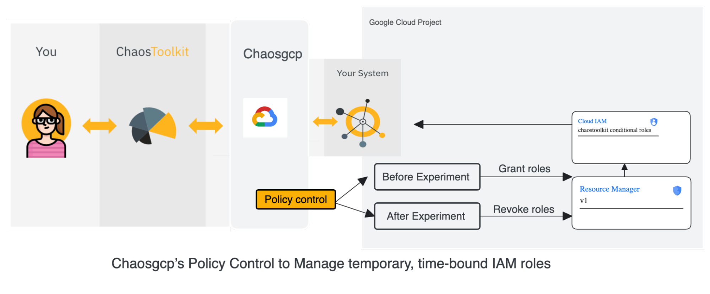
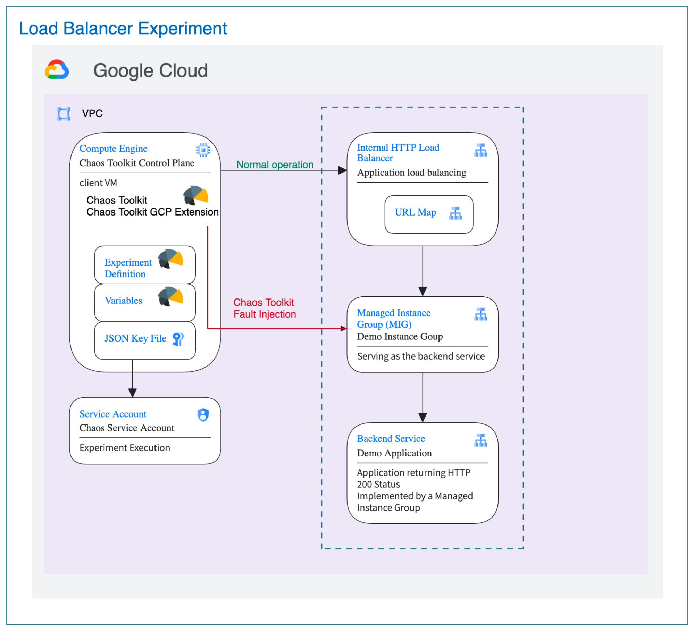
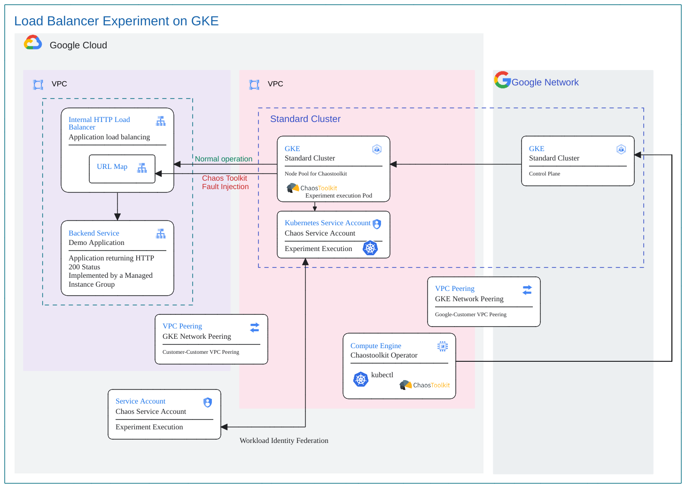

**Chaos Engineering Recipes Book**

Authors: Parag Doshi (GCC NA Team), Ashish Jain (GSD). Satya Singh (GSD)

## Introduction

In today's fast-paced digital world, ensuring the resilience and reliability of applications and services is critical. Chaos Engineering is a discipline that helps organizations proactively identify weaknesses in their systems before they manifest as costly outages or failures. Chaos Engineering involves introducing controlled, real-world disruptions into a system to test its robustness, recoverability, and fault tolerance.

This document provides recipes of different experiments that use the Chaos Toolkit framework along with the Google Cloud Platform (GCP) extension of the Chaos Toolkit, demonstrating how it can be used to create impactful chaos experiments within the GCP ecosystem. 

## Please note: 
 This is not an officially supported Google product.
 
## Chaos Engineering Concepts 
Chaos Engineering uses these concepts to define and create fault injection programs.

### Experiment 

A **chaos experiment** is an intentional, planned process through which faults are injected into a system to learn how it responds.

### Steady State Hypothesis 

A Steady State Hypothesis describes “what normal looks like” for your system

### Actions 

An action is a particular activity that needs to be enacted on the system under experimentation.

### Probes 

A probe is a way of observing a particular set of conditions in the system that is undergoing experimentation.

### Rollback 

An experiment may define a sequence of actions that revert what was undone during the experiment.

## How to Use This Guide 

Each recipe is stand alone and you can jump to relevant recipes based on either the scenario or targeting a specific GCP service. Each recipe has different sections that summarize the use case and provide relevant links to Google Cloud Platform Chaos Engineering repository. Each experiment has a Readme.md file that provides step-by-step guidance for executing the experiment. The recipe also includes the repo link for the source code of the experiment and the action/probes used by the experiment.

### Code Repositories 

There are three main repositories that are used by these recipes:

1. **[Chaos Toolkit Repository](https://github.com/chaostoolkit/chaostoolkit)**: This repository contains the executable and core execution logic for Chaos Toolkit tooling/framework. Most of the time, we use the code in this repository as-is. This is like a runtime library that is used for executing any experiments that are written using the Chaos Toolkit framework.
2. **[Google Cloud Platform Chaos Toolkit Extension Repository](https://github.com/chaostoolkit-incubator/chaostoolkit-google-cloud-platform)**: This repository has all action, control and probes related to GCP products. For instance, if an experiment wants to inject a fault in a URL map, then there will be a corresponding ‘action’ function implemented in this repository. Similarly, if there is a ‘probe’ that is needed to verify the steady state hypothesis, then the logic for the probe would be implemented in this repository. 
3. **[Google Cloud Platform Chaos Engineering Repository](https://github.com/GoogleCloudPlatform/chaos-engineering)**: This repository contains the terraform code, shell scripts and experiment json files that are required for executing the experiments. This is the repository that has the Readme.md file and should be used as the starting point for trying out these experiments.  

      

## Recipe: Injecting Fault in L7 Load Balancer 

### Overview  

This recipe is suitable for applications or APIs that are configured as backend service on a GCP [L7 internal application load balancer](https://cloud.google.com/load-balancing/docs/l7-internal). A simple web application is configured to run on a GCE VM that is configured as a backend service on a L7 Internal Application Load Balancer. Fault is injected by adding a fault injection policy to the [route](https://cloud.google.com/load-balancing/docs/l7-internal/traffic-management#route_actions) of the load balancer’s [URL Map](https://cloud.google.com/load-balancing/docs/url-map-concepts) resource so that requests that match a particular url pattern path matcher are shown a 503 error. This recipe will also work on L7 external load balancers.

### GCP/Open Source Services Used  

[L7 Internal Load Balancer](https://cloud.google.com/load-balancing/docs/l7-internal), [URL Maps](https://cloud.google.com/load-balancing/docs/url-map-concepts), [Managed Instance Groups](https://cloud.google.com/compute/docs/instance-groups), [Compute Engine VM](https://cloud.google.com/compute/docs/overview), [Chaos Toolkit](https://chaostoolkit.org/reference/tutorial/)

### Fault Injected in GCP Service 

[URL Map of the Load Balancer](https://cloud.google.com/load-balancing/docs/url-map-concepts)

### Architecture Diagram 

#### Steady State Architecture 

#### Fault Injection Architecture 

### Links 

#### [Readme file](https://github.com/GoogleCloudPlatform/chaos-engineering/blob/main/chaostoolkit-examples/l7ilb-urlmap-fault-injection/README.md)  

#### [Experiment Code](https://github.com/GoogleCloudPlatform/chaos-engineering/blob/main/chaostoolkit-examples/l7ilb-urlmap-fault-injection/chaos-experiment/config/experiment.json) 

## Recipe: Injecting Latency Fault Between Cloud Run and Cloud SQL Using ToxiProxy

### Overview 
This recipe demonstrates how to inject latency between an application and a database.  In this recipe, we have an application running on Cloud Run that retrieves data from a Cloud SQL database. Cloud Run uses Serverless VPC Connector for Cloud Run to connect to the Cloud SQL database that exposes a Private Service Connect (PSC) endpoint. The PSC endpoint is configured in Cloud DNS. The fault is injected by updating the DNS record to point to the ToxiProxy server that acts as a ‘man-in-middle’.  There is a toxin configured to inject a latency of 30 seconds for any request coming for the Cloud SQL database. 

### GCP/Open Source Services Used  
[Cloud Run](https://cloud.google.com/run/docs/overview/what-is-cloud-run), [Cloud DNS](https://cloud.google.com/dns/docs/overview), [Cloud SQL](https://cloud.google.com/sql/docs/introduction), [Private Service Connect](https://cloud.google.com/vpc/docs/private-service-connect), [Compute Engine VM](https://cloud.google.com/compute/docs),  [Chaos Toolkit](https://chaostoolkit.org/reference/tutorial/), Chaos Toolkit [ToxiProxy Extension](https://chaostoolkit.org/drivers/toxiproxy/).

### Fault Injected in GCP Service
[Cloud DNS](https://cloud.google.com/dns/docs/overview)

### Architecture Diagram

#### Steady State Architecture 

#### Fault Injection Architecture 

### Links 

#### [Readme file](https://github.com/GoogleCloudPlatform/chaos-engineering/blob/main/chaostoolkit-examples/cloudsql-cloudrun-dns-fault-injection/README.md)  

#### [Experiment Code](https://github.com/GoogleCloudPlatform/chaos-engineering/blob/main/chaostoolkit-examples/cloudsql-cloudrun-dns-fault-injection/chaos-experiment/config/experiment.json) 

## Recipe: CloudSQL-CloudRun Policy Based Routes Fault Injection 

### Overview 

The experiment is aimed at injecting a simple fault in the Policy Based routes. Compute Engine VM is provisioned that has access to the Cloud Run service. VPC Serverless Connector is provisioned to allow connection from Cloud Run to the provisioned Cloud SQL service. In steady state, there is a normal dns route from the cloud run path to cloud sql.  

### GCP/Open Source Services Used 

   [Chaos Toolkit](https://chaostoolkit.org/)

   [Chaos Toolkit Google Cloud Driver](https://chaostoolkit.org/drivers/gcp/)  

   [GCP Cloud SQL](https://cloud.google.com/sql/docs/introduction?_gl=1*hkvv02*_up*MQ..&gclid=CjwKCAjwvvmzBhA2EiwAtHVrbxG3DZ5RGkcWB8KfDB3N0OHVsJL7KcTvbAPDV7yuwqGAmvOGDxWTThoC22YQAvD_BwE&gclsrc=aw.ds)

   [GCP Cloud Run](https://cloud.google.com/run/docs/overview/what-is-cloud-run)

### Fault Injected in GCP Service 
The chaos toolkit extension is installed on the GCE client. This toolkit creates Policy-Based Route that is used for the fault traffic from serverless vpc connector going to cloud SQL. Toxiproxy Server VM acts as the man in the middle that adds latency to the DB connection. The chaos toolkit is thus used to inject latency fault in the steady state system.

### Architecture Diagram 

#### Steady State Architecture 

#### Fault Injection Architecture

### Links  

#### [Readme File](https://github.com/GoogleCloudPlatform/chaos-engineering/blob/main/chaostoolkit-examples/cloudsql-cloudrun-pbr-fault-injection/README.md) 

#### [Experiment Code](https://github.com/GoogleCloudPlatform/chaos-engineering/blob/main/chaostoolkit-examples/cloudsql-cloudrun-pbr-fault-injection/chaos-experiment/config/experiment.json) 

#### [Chaos GCP PBR Actions](https://github.com/chaostoolkit-incubator/chaostoolkit-google-cloud-platform/blob/master/chaosgcp/networkconnectivity/actions.py) 

## Recipe: Adding Policy Control to the experiment  

### Overview 

The  ChaosGCP IAM Policy Control  allows you to manage temporary, time-bound IAM roles for a specified project and members. This control grants specified IAM roles to the provided members, with an expiration time determined by the given parameter. It can be used to grant and revoke IAM roles to/from specified members before and after an experiment, respectively.

This control can be used to improve the security of Chaos Toolkit experiments by ensuring that IAM roles are only granted for the duration of the experiment. The ChaosGCP IAM Policy Control is Python-based and designed to be used in conjunction with Chaos Toolkit experiments to grant and revoke IAM roles.

### GCP/Open Source Services Used 

1. [Chaos Toolkit](https://chaostoolkit.org/)
2. [Chaos Toolkit Google Cloud Driver](https://chaostoolkit.org/drivers/gcp/)  
3. [Google Cloud Resource Manager](https://cloud.google.com/resource-manager)
4. [Google Cloud IAM](https://cloud.google.com/iam/docs/overview)

### Architecture Diagram 

### Adding control to experiment 

For an experiment using GCP members' roles to perform tasks, policy control can be added to ensure that IAM roles are only granted for the duration of the experiment.

To use the control, users must add it to their experiment definition in the "controls" section. The control accepts the following arguments:

*   project_id: The ID of the project where the roles will be managed.
*   roles: A list of IAM role names to grant/revoke.
*   members: A list of members to grant/revoke roles to.
*   iam_propogation_sleep_time_in_minutes: Optional (default: 2). The time to wait, in minutes, for IAM propagation to complete before the experiment starts.
*   expiry_time_in_minutes: Optional (default: 10). The time, in minutes, after which the granted IAM roles expire. (Default: 10). The roles will be revoked or expired when the experiment finishes or when the expiry time is reached, whichever comes first. The iam_propogation_sleep_time_in_minutes is added to the expiry time to compensate for the propagation delay.

Sample json format : 

https://github.com/chaostoolkit-incubator/chaostoolkit-google-cloud-platform/tree/master/chaosgcp/iam/controls

### Links 

#### [IAM Policy Control Code](https://github.com/chaostoolkit-incubator/chaostoolkit-google-cloud-platform/tree/master/chaosgcp/iam/controls) 

## Recipe: Injecting Fault in Managed Instance Group (MIG) 

### Overview 

The experiment is aimed at injecting a simple fault in an MIG and checking if it would still be able to handle incoming requests. The MIG is exposed via an L7 Internal Load Balancer. The backend VM instances of the MIG are set up to run a simple nginx web server. The experiment probes the steady state of the system first to establish that the system works fine in a normal situation. The fault is then injected and the system is probed again to check if its tolerance is still 200.

### GCP/Open Source Services Used 

   [Chaos Toolkit](https://chaostoolkit.org/)

   [Chaos Toolkit Google Cloud Driver](https://chaostoolkit.org/drivers/gcp/)  

   [GCP Internal L7 Load Balancer](https://cloud.google.com/load-balancing/docs/l7-internal)

   [GCP Managed Instance Groups](https://cloud.google.com/compute/docs/instance-groups)

 
   [GCP Compute Engine VMs](https://cloud.google.com/compute/docs/instances)

### Fault Injected in GCP Service  

An MIG with two GCE instances was created for this experiment. One of the backend VMs was suspended to check if the system was still able to respond to the incoming requests. Upon checking, the suspended VM was resumed and the system was rolled back to its steady state.

### Architecture Diagram 

#### Steady State Architecture 

#### Fault Injection Architecture  

### Links  

#### [Readme File](https://github.com/GoogleCloudPlatform/chaos-engineering/blob/main/chaostoolkit-examples/l7ilb-mig-fault-injection/README.md)  

#### [Experiment Code](https://github.com/GoogleCloudPlatform/chaos-engineering/blob/main/chaostoolkit-examples/l7ilb-mig-fault-injection/chaos-experiment/config/experiment.json)  

#### [Chaos GCP Compute Suspend/Resume Functions](https://github.com/thesatyasingh/chaostoolkit-google-cloud-platform/blob/5d516f9130fd297afa1972c7f1fe623541a0c0f3/chaosgcp/compute/actions.py#L79) 

## Recipe: Injecting Fault in GKE Pods  

### Overview  

The experiment is aimed at injecting a simple fault in a GKE pod and checking if it would still be able to handle incoming requests. The application running in the GKE cluster is exposed via a Network Pass Through Load Balancer. The pods are set up to run a simple nginx web server. The experiment probes the steady state of the system first to establish that the system works fine in a normal situation. The fault is then injected and the system is probed again to check if its tolerance is still 200.

### GCP/Open Source Services Used 

[Chaos Toolkit](https://chaostoolkit.org/)

   [Chaos Toolkit Google Cloud Driver](https://chaostoolkit.org/drivers/gcp/)  

   [Google Kubernetes Engine](https://cloud.google.com/kubernetes-engine/docs/concepts/kubernetes-engine-overview)

   [GCP Compute Engine VMs](https://cloud.google.com/compute/docs/instances)

### Fault Injected in GCP Service 

A GKE cluster with three nodes was created for this experiment. One of the pods was killed to check if the system was still able to respond to the incoming requests. GKE inherently reverts to three pods as soon as one of the pods is killed. Thus, the steady state is achieved again.

### Architecture Diagram  

#### Steady State Architecture  

#### Fault Injection Architecture  

### Links 

#### [Readme File](https://github.com/GoogleCloudPlatform/chaos-engineering/blob/main/chaostoolkit-examples/gke-pod-fault-injection/README.md) 

#### [Experiment Code](https://github.com/GoogleCloudPlatform/chaos-engineering/blob/main/chaostoolkit-examples/gke-pod-fault-injection/chaos-experiment/config/experiment.json) 

#### [Chaos Toolkit k8s Extension Code](https://github.com/chaostoolkit/chaostoolkit-kubernetes/blob/5d786b992b3553cb1072d25efe5a162e3da037ac/chaosk8s/pod/actions.py#L22)  

## Recipe: L7ILB-UrlMap Fault Injection through GKE  

### Overview 

This recipe demonstrates a chaos engineering experiment that injects faults into a Google Cloud Platform (GCP) L7 Internal Load Balancer (ILB) running on a Google Kubernetes Engine (GKE) cluster.

### GCP/Open Source Services Used  

   [Chaos Toolkit](https://chaostoolkit.org/)

   [Chaos Toolkit Google Cloud Driver](https://chaostoolkit.org/drivers/gcp/)  

   [Google Kubernetes Engine](https://cloud.google.com/kubernetes-engine/docs/concepts/kubernetes-engine-overview)

   [GCP Internal Load Balancer](https://cloud.google.com/load-balancing/docs/internal)

   [Google Compute Engine](https://cloud.google.com/compute/docs)

### Fault Injected in GCP Service 

The fault injected in this experiment targets the GCP L7 Internal Load Balancer (ILB) by manipulating its URL map. The application is initially running in a healthy state, responding with HTTP status code 200 to incoming requests. A fault is introduced into the URL map, causing it to become unresponsive or return errors. The experiment observes the impact of the fault on the application's behavior, checking for HTTP 500 errors or other unexpected responses. The fault is removed, and the URL map is restored to its original state. The experiment verifies that the application recovers to the steady state and resumes responding with HTTP 200.

### Architecture Diagram  

#### Steady State Architecture 

#### Fault Injection Architecture  

### Links  

#### [Readme File](https://github.com/GoogleCloudPlatform/chaos-engineering/blob/main/chaostoolkit-examples/l7ilb-urlmap-fault-injection-gke/README.md)  

#### [Experiment Code](https://github.com/GoogleCloudPlatform/chaos-engineering/blob/main/chaostoolkit-examples/l7ilb-urlmap-fault-injection-gke/chaos-experiment/scripts/setupChaos.sh)  

#### [Chaos GCP Actions](https://github.com/chaostoolkit-incubator/chaostoolkit-google-cloud-platform/blob/master/chaosgcp/lb/actions.py#L140) 
