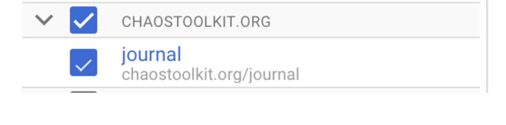
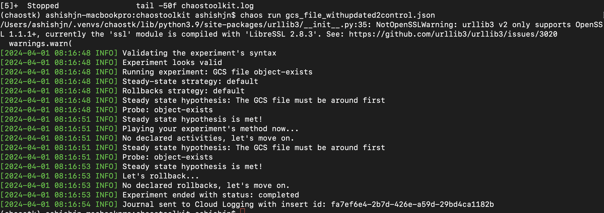
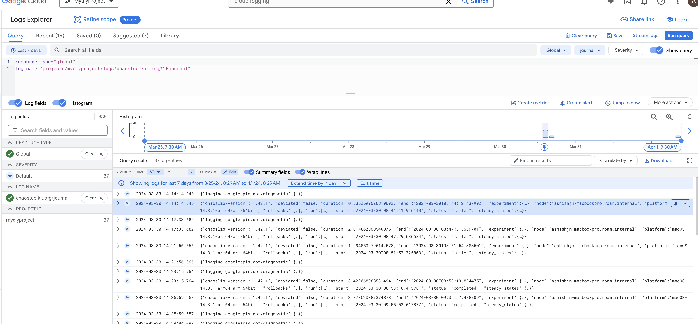
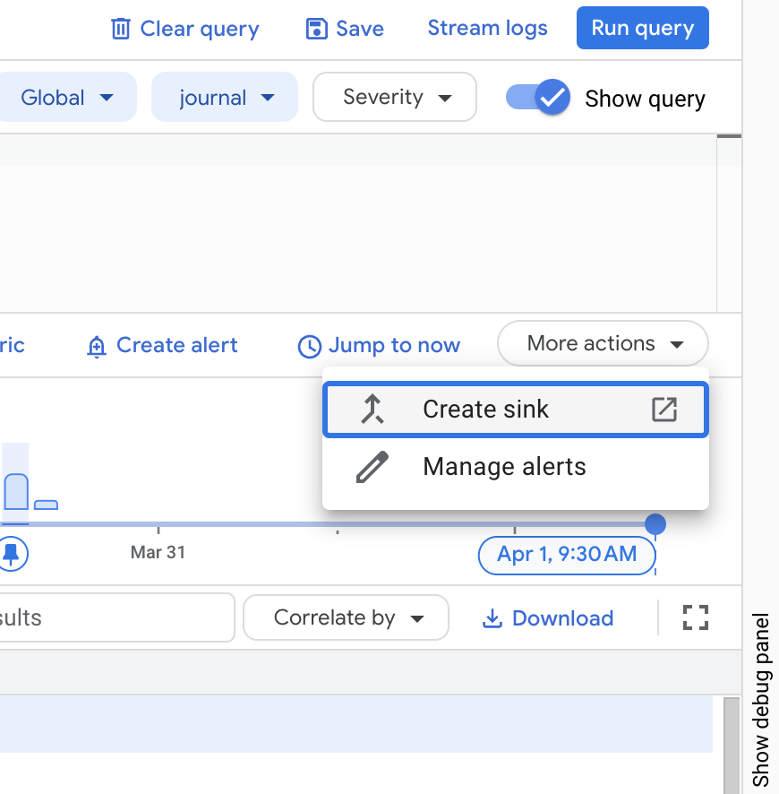
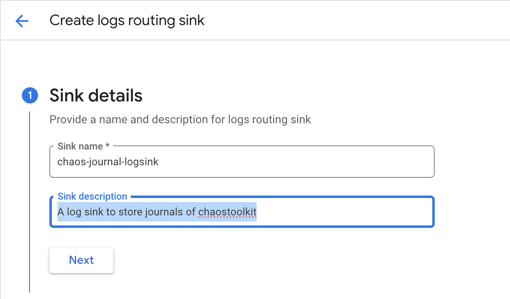
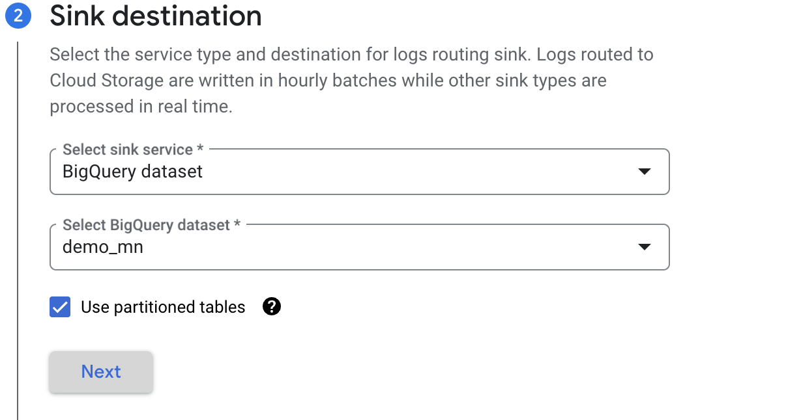
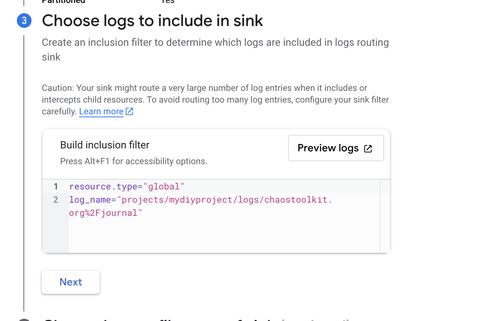
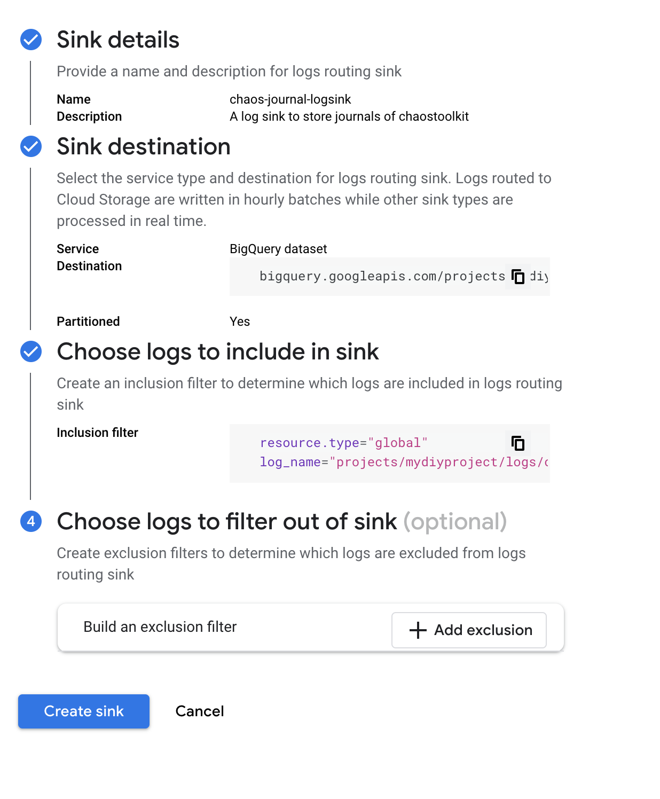
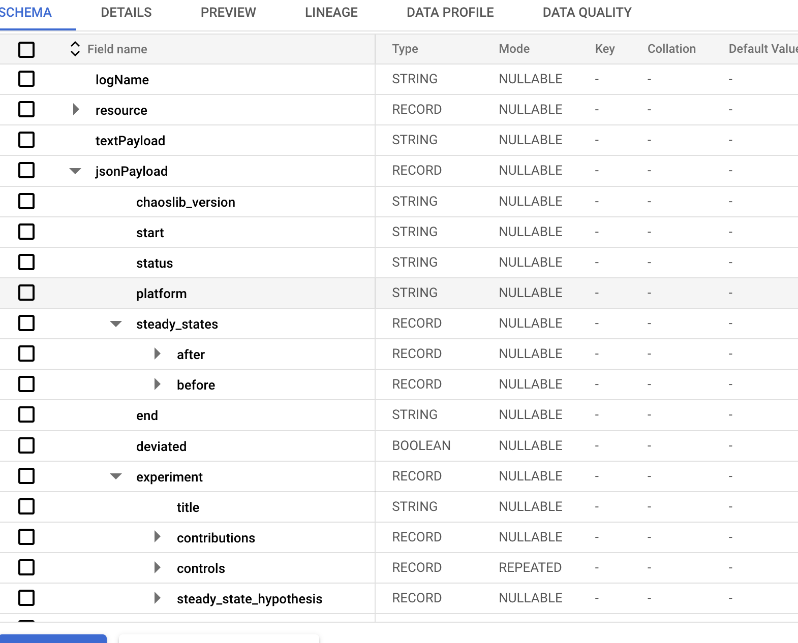
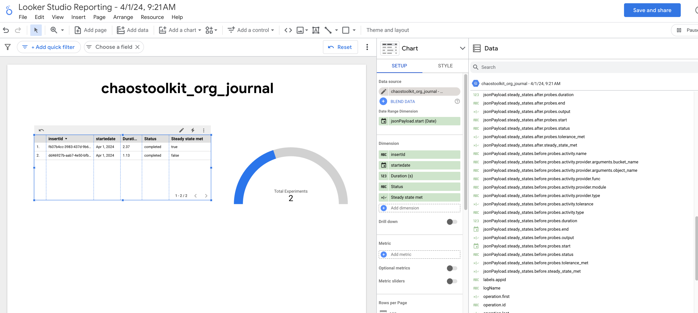

## Sending Journal Logs from ChaosToolkit  to Cloud Logging  

1. The Application default credential principal should have roles/logging.logWriter.

2. The local Journal.json file gets overwritten. But each json will be sent as Single JsonPayload to cloud logging under the log name 
chaostoolkit.org%2Fjournal
Appears as below .

3. The local logs available in chaostoolkit.log works in append fashion . It will be available locally and currently not being sent to cloud logging .

4. To send the journal logs to cloud logging , mention this control in your experiment’s json file 

Below sample json shows how to use controls .
Set  "appid": "123456" to the user given name to identify the App on the bigquery/looker dashboard . You can have multiple labels as per the requirement .
The control module which is being used is 
"module": "chaosgcp.cloudlogging.controls.journal",

{
    "title": "GCS file object-exists",
    "description": "Our application should re-create a GCS file that was removed",

    "contributions": {
        "reliability": "high",
        "availability": "high"
    },
      "controls": [
        {
            "name": "gcp-journal-logger",
            "provider": {
                "type": "python",
                "module": "chaosgcp.cloudlogging.controls.journal",
                "arguments": {
                    "labels": {
                        "appid": "123456"
                    }
                }
            }
        }
    ],
    "steady-state-hypothesis": {
        "title": "The GCS file must be around first",
        "probes": [
                {
        "name": "object-exists",
        "type": "probe",
        "tolerance": true,
        "provider": {
        "type": "python",
        "module": "chaosgcp.storage.probes",
        "func": "object_exists",
        "arguments": {
          "bucket_name": "chaos-toolkit-test-bucket",
          "object_name": "t2est.txt"
        }
        }
        }
        ]
    },
    "method": [
        
    ]
}

5. The output should have an entry at the end which says Journal sent to cloud logging with insert id .This Insert id is unique and will be available in cloud logging as well to identify the journal for this run .

6. Below is the screenshot of cloud logging with filter 
resource.type="global"
log_name="projects/mydiyproject/logs/chaostoolkit.org%2Fjournal"

7. The JsonPayload will have required fields and a Bigquery log sink can be created to route these logs to the bigquery table .
Please refer to the below .

8. New logs will be routed to the bigquery table named same as sink name .

9. Use below custom query to build dashboard on looker .

>SELECT *  FROM `mydiyproject.demo_mn.chaostoolkit_org_journal` WHERE jsonPayload.experiment is not null jsonPayload.experiment is not null , this is required because there will be few entries which is not required 

10. The sample Looker dashboard looks like below . which shows total experiments run count and status of steady state probe with app id.

Reference : 
https://github.com/chaostoolkit-incubator/chaostoolkit-google-cloud-platform/commit/86c7288bd03411b5383df49e48cbfdbebcaa04f6

