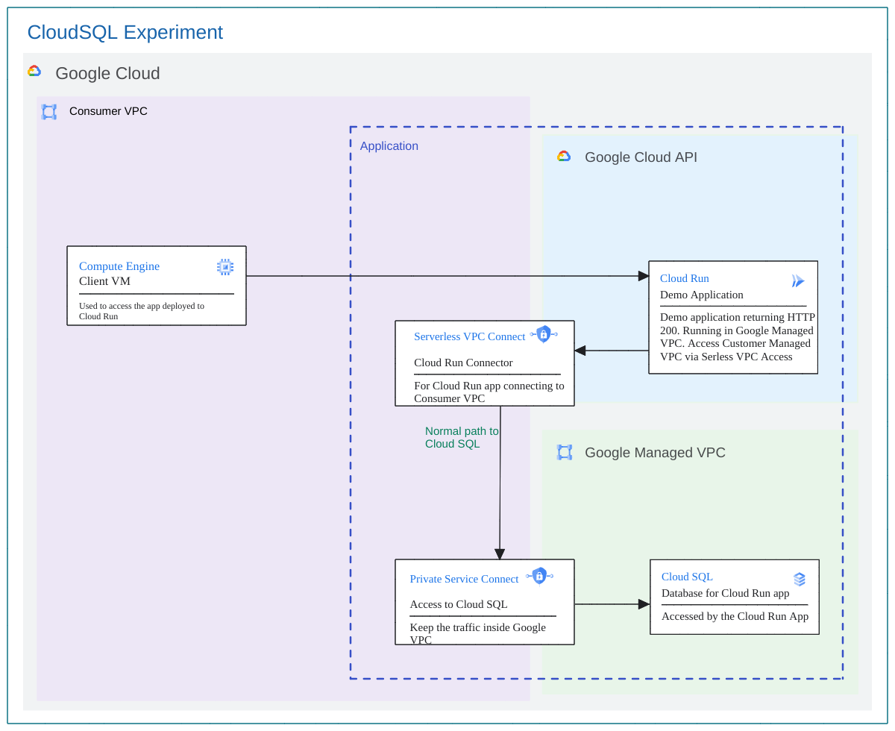
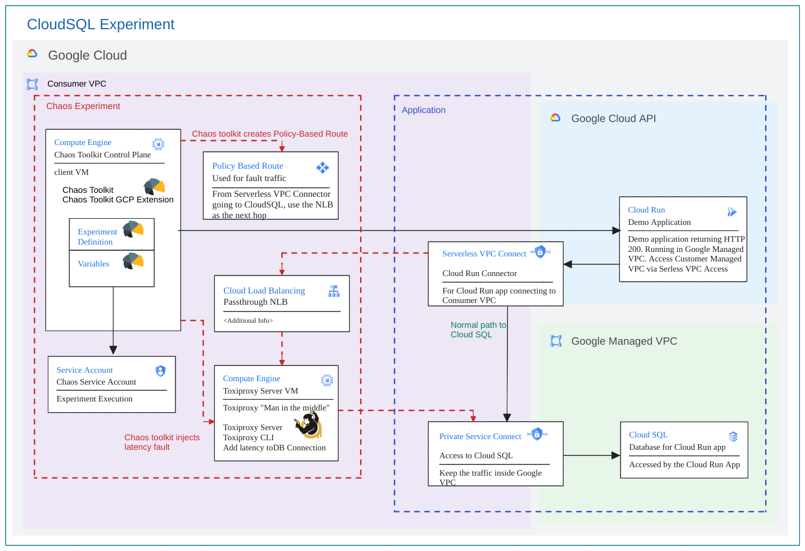

# Overview
This documentation illustrates the steps involved in executing an end to end proof of concept to demonstrate the ability to introduce faults in GCP CloudSQL instances, primarily leveraging the Chaos Toolkit framework and its GCP extension.

## Jumpstart Guide

Here is the directory structure

```
$ROOT_FOLDER_OF_THE_REPO
└── chaostoolkit-examples
    └── cloudsql-cloudrun-pbr-fault-injection
        └── scripts
            ├── cleanup.sh
            ├── check_client_log.sh 
            ├── copy_to_client.sh 
            ├── init.sh
            ├── provision.sh
            ├── remote_run.sh
            └── ssh_to_client.sh
```

This recipe can be run by following these steps, `cd chaostoolkit-examples/cloudsql-cloudrun-pbr-fault-injection/scripts`

1. Initiate the environment, `./init.sh`

2. Provision the application and chaos experiement,`./provision.sh`

3. Experiment Execution, `./ssh_to_client.sh` to ssh to the client VM, then run `./run.sh`, or you can just run `./remote_run.sh`

4. Cleanup, `./cleanup.sh`

That's it. Let us dive in.

## The Steady State Application

The following diagram illustrates an applicaiton deployed to Cloud Run and connecting to Cloud SQL.


#### Picture 1: Application Architecture

This directory has three subdirectories as follows:-

## cloudruncode Subdirectory

This folder has the basic python code for querying data from database

| File             | Description |
| ----             | ----------- |
|`Docerfile`       | Docker container file|
|`main.py`         | The application that connect to CloudSQL inside the Docker container|
|`requirement.txt` | Requirement file for Docker build.|


## scripts Subdirectory
This folder is for shell scripts

| File                 | Description |
| ----                 | ----------- |
|`createSA.sh`         | Shell script to create Service Account |
|`setupApp.sh`         | Shell script to setup the envionment to run terraform.|

## Terraform Subdirectory
On execution of this terraform module, the following infrastructure components will be deployed on a given project ID:- 

| File                      | Description |
| ----                      | ----------- |
|`api.tf`                   | To enable mandatory APIs required for deploying the infrastructure components|
|`cloudrun.tf`              | Creating a cloud run instance so it can be destroyed by terraform, but the deployment is still done by `../scripts/main.sh`|
|`cloudsql.tf`              | The file for deploying infrastructure components such as Cloud SQL instance with Private Service Connect|
|`firewall.tf`              | The file for deploying infrastructure components such as filewall rules.|
|`gce-toxicproxy`           | For deploying the toxiproxy server instances on GCP|
|`ip.tf`                    | The file for deploying infrastructure components such as static IP and forwarding rule.|
|`outputs.tf`               | File used to define output declarations in Terraform configuration files|
|`provider.tf`              | File that allows Terraform to interact with Google Cloud|
|`sa.tf`                    | For creating the service account to be used for running application|
|`secret-manager.tf`        | Create a secret manager and save the database username and passwrod  as secrets.|
|`template.tf`              | The template file that generales the other shell scripts files|
|`terraform.tfvars.template`| Defines the actual value of variables for Terraform infrastructure deployment. Use this file to generate custom values for any Terraform variable(s) in `terraform.tfvars` file|
|`variables.tf`             | For the declaration of variables, name, type, description, default values and additional meta data|
|`vpc.tf`                   | The file for deploying infrastructure components such Vs PC networks.|


## Chaos Experiment 

This experiment demonstrates how faults can introduced faulty DNS name. The steady state is application responding 200 from server and when DNS becomes faulty, it responds with a 500. The following is the architecture diagram for the chaos experiment.



#### Picture 2: Chaos Experiment Architecture


### config Subdirectory

For artifacts pertaining to the chaos experiment. Following files are enclosed:

| File                | Description |
| ----                | ----------- |
|`experiment.json`    | Lists out the experiment, including the steady state hypothesis, probes and rollback after experiment is complete|


### scripts Subdirectory
This folder is for shell scripts

| File               | Description |
| ----               | ----------- |
|`client_startup.sh` | Shell script to during the client provisioning|
|`run.sh`            | shell script to run this experiment1|
|`server_startup.sh` | Shell script to during the server provisioning|
|`setupChaos.sh`     | Shell script to setup the envionment to run terraform.|

### Terraform Subdirectory
On execution of this terraform module, the following infrastructure components will be deployed on a given project ID:- 

| File                      | Description |
| ----                      | ----------- |
|`api.tf`                   | To enable mandatory APIs required for deploying the infrastructure components|
|`check_client_log.tf`      | The template file that generales the Shell script to ssh to the client vm and do `tail -f /var/log/syslog` on that VM|
|`experiment-variables.tf`  | The template file that generats the `variables.env` file|
|`gce-client`               | For deploying the client instances on GCP|
|`lb.rf`                    | Create a paththrough network load balancer as the next hop of the Policy Based d Route.
|`provider.template`        | File that allows Terraform to interact with Google Cloud|
|`remote_run.tf`            | The template file that generales the Shell script to SSH to client VM and run the experiment|
|`sa.tf`                    | For automatically creating the chaos service account to be used for running `experiment.json`|
|`scp_to_client.tf`         | The template file that generales the `copy_to_client.sh` file|
|`ssh_to_client.tf`         | The template file that generales the Shell script to SSH to client VM|
|`terraform.tfvars.template`| Defines the actual value of variables for Terraform infrastructure deployment. Use this file to generate custom values for any Terraform variable(s) in `terraform.tfvars` file|
|`variables.tf`             | For the declaration of variables, name, type, description, default values and additional meta data|


## PreRequisites
1. Make sure that you have Google CLI and Terraform installed.
2. The GCP user to run the experiment should have the permissions to impersonate the terraform service account used to create the resources.
```
    Service Account Token Creator
    Service Account User
    Servie Uasge Admin
```

3. The following IAM permissions are required on the terraform service account to create the GCP infra resources required for this experiment, run [createSA.sh](scripts/createSA.sh) once to create them. If new roles are identifed for the SA, please modify the scripts and run it again.

```
    Compute Admin
    Compute Network Admin
    DNS Administrator
    Serverless VPC Access Admin
    Monitoring Editor 
    Cloud SQL Admin
    Clound Run Admin
    Create Service Account
    Delete Service Account
    Project IAM Admin
    Service Account User
    Service Account Token Creater
    Service Account Key Admin
    Service Usage Admin
    Cloud Build Service Account
    Viewer
```

4. Make sure these APIs are enabled, `Cloud Resource Manager API`, and `Service Usage API`. These services are required by Terraform to run `terraform plan`.

5. If it doesn't exist, please create a GCS Bucket for Terraform Backend for the project, the name need to be `${project-Id}-terraform-backend`. For example, if the project id you work on is `chaos-test-project-410715`, then the bucket name should be `chaos-test-project-410715-terraform-backend`. Please also create local folder for terraform to generate some helper scripts.
```
sudo mkdir -p /opt/chaostoolkit-examples/
sudo chmod -R 777 /opt/chaostoolkit-examples
```

## Experiment Execution

1. Login to GCP project using `gcloud auth login` on the terminal to execute terraform resources and set the project.
2. Clone the repository to your system and cd into `chaostoolkit-examples/cloudsql-cloudrun-fault-injection/app/scripts` directory.
3. For deploying new infrastructure only, `terrform.tfvars.tempalte` file will be used for generating `terraform.tfvars`. You don't need to change anything in that file.  For information regarding the resources created by terraform and the variables required, pls check [Terraform README.md](etrraform/README.md)
4. In case pre-existing testing infrastructure exists, skip to step 7.
5. Run command, `./setupApp.sh`. The service account for terraform will be created for you, and generate `terraform/terraform.tfvars` with default values.Please make a note of the Service Account created for running the experiment from terraform output. A [service account key](https://cloud.google.com/iam/docs/keys-create-delete?_ga=2.31241532.-2014251715.1702981216) for the service account is created by terraform. This will be used for running the experiment. In case the Infra is pre-existing, please use a service account with the following IAM roles:

```
   Cloud Run Invoker
   Cloud Run Developer
   Compute Network Admin
   Cloud SQL Admin
   Cloud SQL Client
   Compute Instance Admin
   DNS Administrator
``` 

6. cd into `chaostoolkit-examples/cloudsql-cloudrun-pbr-fault-injection/app/terraform`, and run `terraform init` to initialize Terraform, `terraform validate` to validate the configuration, `terraform plan` to visualize the components that will be created, and `terraform apply` to deploy the infrastructure on the set project. Your testing infrastructure should now be ready. 

7. cd into `../../chaos-experiment/scripts` directory. Run the following command, `./setupChaos.sh`.
     
8. cd into `chaostoolkit-examples/cloudsql-cloudrun-pbr-fault-injection/chaos-experiment/terraform`, and run `terraform init` to initialize Terraform, `terraform validate` to validate the configuration, `terraform plan` to visualize the components that will be created, and `terraform apply` to create choas experience resources. 

The following files will be generated under `$folder` folder defined in `.setEnv.sh`

| File                  | Description |
| ----                  | ----------- |
|`copy_to_client.sh`    | Shell script to SCP all the file under `../chaos-experiment-config` to client VM|
|`ssh_to_client.sh`     | Shell script to SSH to client VM|
|`remote_run.sh`        | Shell script to SSH to client VM and run the experiment|
|`check_client_log.sh`  | Shell script to ssh to the client vm and do `tail -f /var/log/syslog` on that VM|
|`check_server_log.sh`  | Shell script to ssh to the server vm and do `tail -f /var/log/syslog` on that VM|
|`variables.env`        | Defines the variables for `experiment.json`. This file is generated|
|`serviceaccount.json`  | JSON key file for the service account to run experiment. This file will be generated by `terraform apply`|


Scripts under this  directory can be used to call those generated scripts

```
$ROOT_FOLDER_OF_THE_REPO
└── chaostoolkit-examples
    └── l7ilb-urlmap-fault-injection
        └── scripts
            ├── 1-init.sh
            ├── 2-provision.sh
            ├── 3-1-check_client_log.sh 
            ├── 3-3-copy_to_client.sh 
            ├── 3-4-ssh_to_client.sh
            ├── 3-5-remote_run.sh
            └── 9-cleanup.sh
```

You can proceed to run `(scripts) $ ./3-1-check_client_log.sh` 

```
    Jan 31 17:25:58 debian google_metadata_script_runner[857]: startup-script: Using /var/.venvs/chaostk/lib/python3.9/site-packages
    Jan 31 17:25:58 debian google_metadata_script_runner[857]: startup-script: Finished processing dependencies for chaostoolkit-google-cloud-platform==0.14.1
    Jan 31 17:25:58 debian google_metadata_script_runner[857]: startup-script exit status 0
    Jan 31 17:25:58 debian google_metadata_script_runner[857]: Finished running startup scripts.
    Jan 31 17:25:58 debian systemd[1]: google-startup-scripts.service: Succeeded.
    Jan 31 17:25:58 debian systemd[1]: Finished Google Compute Engine Startup Scripts.
    Jan 31 17:25:58 debian systemd[1]: google-startup-scripts.service: Consumed 4min 6.976s CPU time.
    Jan 31 17:25:58 debian systemd[1]: Reached target Multi-User System.
    Jan 31 17:25:59 debian systemd[1]: Reached target Graphical Interface.
    Jan 31 17:25:59 debian systemd[1]: Starting Update UTMP about System Runlevel Changes...
    Jan 31 17:26:00 debian systemd[1]: systemd-update-utmp-runlevel.service: Succeeded.
    Jan 31 17:26:00 debian systemd[1]: Finished Update UTMP about System Runlevel Changes.
    Jan 31 17:26:00 debian systemd[1]: Startup finished in 2.268s (kernel) + 4min 5.480s (userspace) = 4min 7.749s.
    Jan 31 17:26:05 debian dhclient[459]: XMT: Solicit on ens4, interval 125840ms.
```

This indicates that the client completed installing chaos toolket and dependencies. You can proceed to the next steps:

10. Run experiment remotely using `./3-5-remote_run.sh` or SSH to client VM by using `./3-4-ssh_to_client.sh` and from the client VM, run `./run.sh` which in turn runs `chaos run experiment.json --var-file=variables.env`, expect the following output:

```
   [2024-02-01 04:56:25 INFO] Validating the experiment's syntax
   [2024-02-01 04:56:25 INFO] Experiment looks valid
   [2024-02-01 04:56:25 INFO] Running experiment: What is the impact of introducing fault in cloud run
   [2024-02-01 04:56:25 INFO] Steady-state strategy: default
   [2024-02-01 04:56:25 INFO] Rollbacks strategy: default
   [2024-02-01 04:56:25 INFO] Steady state hypothesis: Application responds
   [2024-02-01 04:56:25 INFO] Probe: app responds without any delays
   [2024-02-01 04:56:25 INFO] Steady state hypothesis is met!
   [2024-02-01 04:56:25 INFO] Playing your experiment's method now...
   [2024-02-01 04:56:25 INFO] Action: setup_toxiproxy_proxy
   [2024-02-01 04:56:25 INFO] Pausing after activity for 1s...
   [2024-02-01 04:56:26 INFO] Action: inject-dns-recordset-update
   [2024-02-01 04:56:27 INFO] Pausing after activity for 10s...
   [2024-02-01 04:56:37 INFO] Action: create_latency_toxic
   [2024-02-01 04:56:37 INFO] Creating toxy latency_toxic for proxy proxy_test with type: latency as a downstream with toxicity 1.0 and attributes {'latency': 30000, 'jitter': 0}
   [2024-02-01 04:56:37 INFO] Pausing after activity for 1s...
   [2024-02-01 04:56:38 INFO] Steady state hypothesis: Application responds
   [2024-02-01 04:56:38 INFO] Probe: app responds without any delays
   [2024-02-01 04:57:18 CRITICAL] Steady state probe 'app responds without any delays' is not in the given tolerance so failing this experiment
   [2024-02-01 04:57:18 INFO] Let's rollback...
   [2024-02-01 04:57:18 INFO] Rollback: inject-dns-recordset-update
   [2024-02-01 04:57:18 INFO] Action: inject-dns-recordset-update
   [2024-02-01 04:57:18 INFO] Pausing after activity for 2s...
   [2024-02-01 04:57:20 INFO] Rollback: delete_toxiproxy_proxy
   [2024-02-01 04:57:20 INFO] Action: delete_toxiproxy_proxy
   [2024-02-01 04:57:20 INFO] Pausing after activity for 1s...
   [2024-02-01 04:57:21 INFO] Experiment ended with status: deviated
   [2024-02-01 04:57:21 INFO] The steady-state has deviated, a weakness may have been discovered
```

## CleanUp
1. Cleanup of the experiment is included in the `experiments.json` file and runs automatically once the experiment is complete.
2. In case any infrastructure was deployed for the testing only, run `terraform destroy` to delete the test infrastructure. Make sure that the only state file in the directory is of the test infrastructure, otherwise any other Terraform infrastructure could also be deleted accidentally.

You can run this script, `./9-cleanup.sh`
