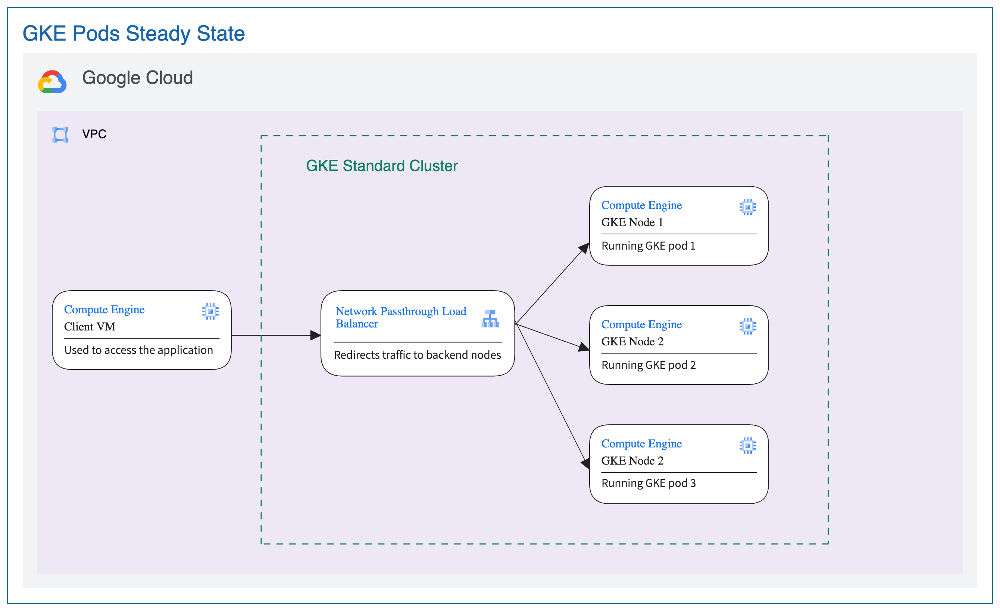
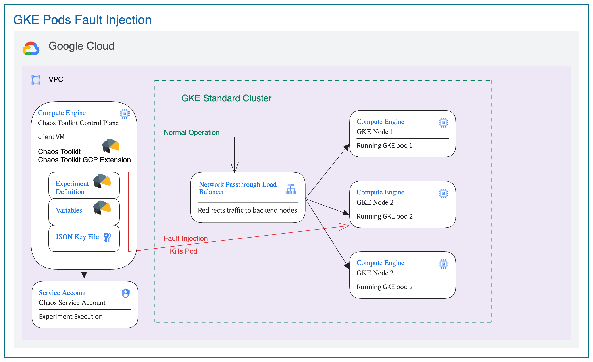

# Overview
This documentation illustrates the steps involved in executing an end to end proof of concept to demonstrate the ability to introduce faults in Google Kubernetes Engine pods, primarily leveraging the Chaos Toolkit framework and its GCP extension. 

## Jumpstart Guide

Here is the directory structure

```
$ROOT_FOLDER_OF_THE_REPO
└── chaostoolkit-examples
    └── gke-pod-fault-injection
        └── scripts
            ├── 1-init.sh
            ├── 2-provision.sh
            ├── 3-1-check_client_log.sh 
            ├── 3-3-copy_to_client.sh 
            ├── 3-4-ssh_to_client.sh
            ├── 3-5-remote_run.sh
            └── 9-cleanup.sh
```
# Pre-requisites
1. Make sure that you have Google CLI and Terraform installed.
2. Login to GCP project using `gcloud auth login` on the terminal to execute terraform resources and set the project.
3. Clone the repository to your system and cd into `chaostoolkit-examples/gke-pod-fault-injection/app/scripts` directory.
4. The GCP user to run the experiment should have the permissions to impersonate the terraform service account used to create the resources.
```
    Service Account Token Creator
    Service Account User
    Servie Uasge Admin
    IAP-secured Tunnel User
```
5. Please create a GCS Bucket for Terraform Backend for the project, the name need to be `${project-Id}-terraform-backend`. For example, if the project id you work on is `chaos-test-project-410715`, then the bucket name should be `chaos-test-project-410715-terraform-backend`.

# Experiment Execution
This recipe can be run by following these steps, `cd chaostoolkit-examples/gke-pod-fault-injection/scripts`.

1. Initiate the environment, `./1-init.sh`

2. Provision the application and chaos experiement,`./2-provision.sh`.

**Note** Allow ~2 minutes for the GCE client to boot up and finish downloading all the dependencies before running the experiment.

3. Experiment Execution, `./3-4-ssh_to_client.sh` to ssh to the client VM, then run `./run.sh`, or you can just run `./3-5-remote_run.sh`

4. Cleanup, `./9-cleanup.sh`

**Note** If you face any permission issue, please run this command: `chmod -R 777 <path_to_experiment_folder>`

To dive deeper into each of these steps and have more fine grained control of the functionalities being executed, please follow the `Manual Experiment Execution` section.

## The Steady State Application

The following diagram illustrates a simple GKE cluster with 2 nodes, a load balancer and 2 running pods.


#### Picture 1: Application Architecture

This directory has two subdirectories as follows:-

### scripts Subdirectory
This folder is for shell scripts

| File              | Description |
| ----              | ----------- |
|`setupApp.sh`         | Shell script to setup the service account and variavble files for running terraform provisioning|

### terraform Subdirectory: 

On execution of this terraform module, the following infrastructure components will be deployed on a given project ID:

| File                      | Description |
| ------                    | ----------- |
|`api.tf`                   | For automatically enabling the required APIs for infrastructure deployment.|
|`app.tf`                   | The application setup to be deployed on the GKE cluster.|
|`cluster.tf`               | The GKE cluster deployment configuration.|
|`network.tf`               | Creating a VPC and other components|
|`outputs.tf`               | File used to define output declarations in Terraform configuration files.|
|`provider.tf`              | File that allows Terraform to interact with Google Cloud.|
|`terraform.tfvars.template`| Defines the variables for Terraform infrastructure deployment. `setup.sh` uses this file to generate custom values for any Terraform variable(s) `terraform.tfvars` file.|
|`variables.tf`             | For the declaration of variables, name, type, description, default values and additional meta data.|


## Chaos Experiment 

This experiment demonstrates how faults can introduced killing a pod in the GKE cluster. The steady state is application responding 200 from server and even when a pod is killed the application responds with 200. The following is the architecture diagram for the chaos experiment.



#### Picture 2: Chaos Experiment Architecture

There are 3 subdirectories for this experiment.

### chaos-experiment-config Subdirectory: 

For artifacts pertaining to the chaos experiment. Following files are enclosed:-

| File                | Description |
| ------              | -----------|
|`experiment.json`    | Lists out the experiment, including the steady state hypothesis, probes and rollback after experiment is complete|

### scripts Subdirectory
This folder is for shell scripts

| File              | Description |
| ----              | ----------- |
|`run.sh`           | Shell script run the experiment by executing `chaos run experiment.json --var-file=variables.env`|
|`setupChaos.sh`    | Shell script to setup the service account and variavble files for running terraform provisioning|
|`startup-script.sh`| Shell script to during the VM provisioning|

### terraform Subdirectory: 

On execution of this terraform module, the following infrastructure components will be deployed on a given project ID:

| File                      | Description |
| ------                    | ----------- |
|`api.tf`                   | For automatically enabling the required APIs for infrastructure deployment.|
|`check_client_log.tf`      | The template file that generales the `check_client_log.sh` file|
|`client_vm.tf`             | Compute Engine which acts as a control plane for fault injection.|
|`experiment-variables.tf`  | The template file that generales the `variables.env` file|
|`outputs.tf`               | File used to define output declarations in Terraform configuration files.|
|`provider.tf`              | File that allows Terraform to interact with Google Cloud.|
|`remote_run.tf`            | The template file that generales the `remote_run.sh` file|
|`sa.tf`                    | For creating the chaos service account to be used for running `experiment.json`|
|`scp_to_client.tf`         | The template file that generales the `copy_to_client.sh` file|
|`ssh_to_client.tf`         | The template file that generales the `ssh_to_client.sh` file|
|`terraform.tfvars.template`| Defines the variables for Terraform infrastructure deployment. `setup.sh` uses this file to generate custom values for any Terraform variable(s) `terraform.tfvars` file.|
|`variables.tf`             | For the declaration of variables, name, type, description, default values and additional meta data.|

# Manual Experiment Execution

1. The following IAM permissions are required on the terraform service account to create the GCP infra resources required for this experiment, , run [createSA.sh](scripts/createSA.sh) once to create them. If new roles are identifed for the SA, please modify the scripts and run it again.

    ```
    Compute Admin
    Create Service Accounts
    Delete service accounts
    Project IAM Admin
    Service Account Token Creator
    Service Account User
    Service Usage Admin
    Viewer
    Kubernetes Engine Admin
    ```
2. Please create local folder for terraform to generate some helper scripts.
```
sudo mkdir -p /opt/chaostoolkit-examples/
sudo chmod -R 777 /opt/chaostoolkit-examples
```

3. Make sure `Cloud Resource Manager API`, `Cloud Usage API` are enabled. Run the following command
   ```
   ./setupApp.sh
   ```
   The service account for terraform will be created for you, and create `terrraform/terraform.tfvars` with default values.
4. You can still update the `terrform.tfvars` file with the appropriate values. For information regarding the resources created by terraform and the variables required, please check [Terraform README.md](./terraform/README.md)
5. Run `terraform init` to initialize Terraform, `terraform validate` to validate the configuration, `terraform plan` to visualize the components that will be created.  run `terraform apply` to deploy the infrastructure on the set project. Your testing infrastructure should now be ready. Please note the Service Account created for running the experiment from terraform output. Terraform code will [Create a service account key](https://cloud.google.com/iam/docs/keys-create-delete) in a local file `../chaos-experiment-config/serviceaccount.json` for the service account created by terraform. This will be used for running the experiment. In case the Infra is pre-existing, please use a service account with `roles/compute.networkViewer` and `roles/compute.loadBalancerAdmin` permissions for this purpose. 


6. cd into `chaostoolkit-examples/gke-pod-fault-injection/chaos-experiment/scripts` directory. Run the following command
```
    ./setupChaos.sh
```
Terraform will generate linux scripts and copy all the files under `../choas-experiment-config` to the client VM.


the following files will be generated under `$folder` folder, as defined in `scripts/.setEnv.sh`

| File                  | Description |
| ----                  | ----------- |
|`check_client_log.sh`  | Shell script to ssh to the client vm and do `tail -f /var/log/syslog` on that VM|
|`copy_to_client.sh`    | Shell script to SCP all the file under `../chaos-experiment-config` to client VM|
|`remote_run.sh`        | Shell script to SSH to client VM and run the experiment|
|`ssh_to_client.sh`     | Shell script to SSH to client VM|


Scripts under this  directory can be used to call those generated scripts

```
$ROOT_FOLDER_OF_THE_REPO
└── chaostoolkit-examples
    └── gke-pod-fault-injection
        └── scripts
            ├── 1-init.sh
            ├── 2-provision.sh
            ├── 3-1-check_client_log.sh 
            ├── 3-3-copy_to_client.sh 
            ├── 3-4-ssh_to_client.sh
            ├── 3-5-remote_run.sh
            └── 9-cleanup.sh
```

For example, you can run `./3-1-check_client_log.sh` to make sure the bootstrap scripts are completed before your run an experiment. The following is an example of the output.
```
WARNING: 

To increase the performance of the tunnel, consider installing NumPy. For instructions,
please see https://cloud.google.com/iap/docs/using-tcp-forwarding#increasing_the_tcp_upload_bandwidth

Jan 31 16:41:49 debian systemd[1]: Started Session 6 of user yujunl.
Jan 31 16:42:07 debian systemd[1]: Started Session 7 of user yujunl.
Jan 31 16:43:24 debian dhclient[464]: XMT: Solicit on ens4, interval 109320ms.
Jan 31 16:44:02 debian systemd[1]: Starting Cleanup of Temporary Directories...
Jan 31 16:44:02 debian systemd[1]: systemd-tmpfiles-clean.service: Succeeded.
Jan 31 16:44:02 debian systemd[1]: Finished Cleanup of Temporary Directories.
Jan 31 16:45:13 debian dhclient[464]: XMT: Solicit on ens4, interval 128930ms.
Jan 31 16:45:20 debian systemd[1]: session-5.scope: Succeeded.
Jan 31 16:45:20 debian systemd[1]: session-5.scope: Consumed 2.400s CPU time.
Jan 31 16:45:48 debian systemd[1]: Started Session 8 of user yujunl.
```

7. Run `./3-5-remote_run.sh` to run the experiment.
 
8. Alternatiely, run `./3-4-ssh_to_client.sh` to ssh to the client VM, then run `./run.sh` which in turn runs `chaos run experiment.json --var-file=variables.env`. Please expect the following output.
```
[2024-06-18 05:46:08 INFO] Validating the experiment's syntax
[2024-06-18 05:46:08 INFO] Experiment looks valid
[2024-06-18 05:46:08 INFO] Running experiment: GKE Pod Experiment
[2024-06-18 05:46:08 INFO] Steady-state strategy: default
[2024-06-18 05:46:08 INFO] Rollbacks strategy: default
[2024-06-18 05:46:08 INFO] Steady state hypothesis: Application responds
[2024-06-18 05:46:08 INFO] Probe: app responds without any delays
[2024-06-18 05:46:08 INFO] Steady state hypothesis is met!
[2024-06-18 05:46:08 INFO] Playing your experiment's method now...
[2024-06-18 05:46:08 INFO] Action: Kill Pod
[2024-06-18 05:46:09 INFO] Steady state hypothesis: Application responds
[2024-06-18 05:46:09 INFO] Probe: app responds without any delays
[2024-06-18 05:46:09 INFO] Steady state hypothesis is met!
[2024-06-18 05:46:09 INFO] Let's rollback...No declared rollbacks, let's move on.
[2024-06-18 05:46:09 INFO] Experiment ended with status: completed
```

# CleanUp
1. Cleanup of the experiment is included in the experiments.json file and runs automatically once the experiment is complete.

2. In case any infrastructure was deployed for the testing only, run `terraform destroy` to delete the test infrastructure. Make sure that the only state file in the directory is of the test infrastructure, otherwise any other Terraform infrastructure could also be deleted accidentally.

You can run this script, `./9-cleanup.sh` to clean up the resoureces used by this experiement.
