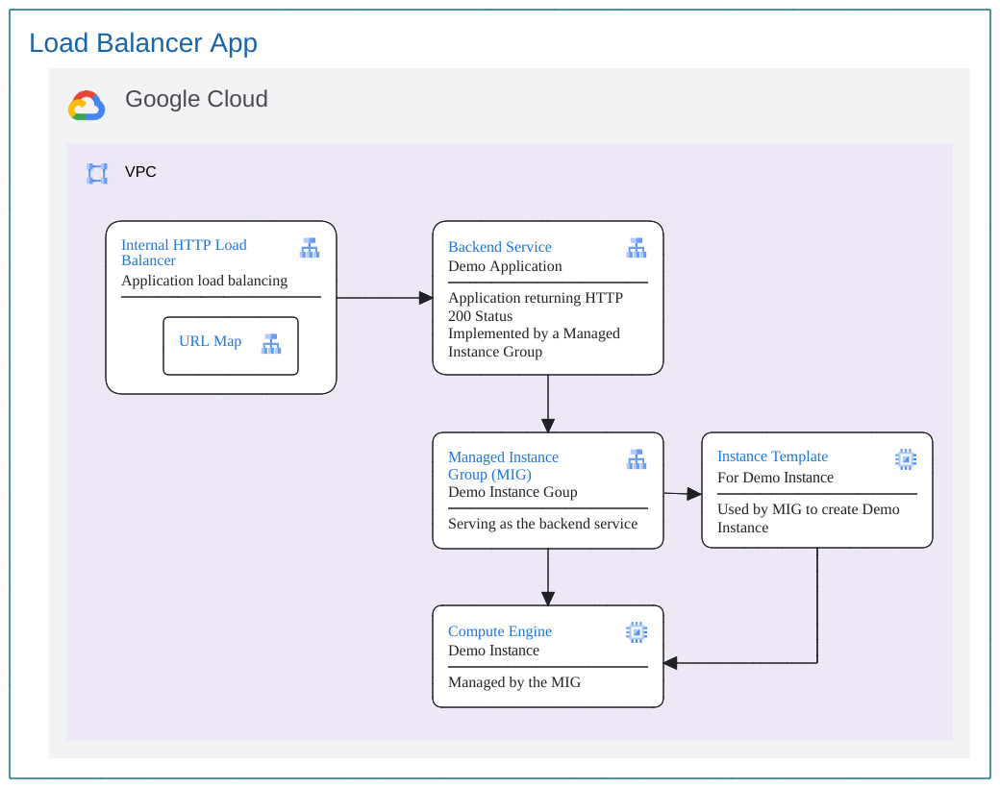
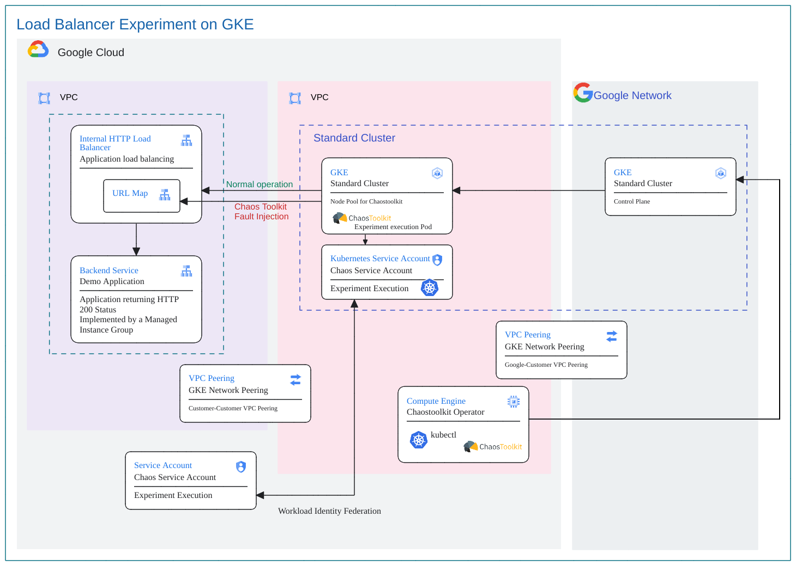

# Overview
This documentation illustrates the steps involved in executing an end to end proof of concept to demonstrate the ability to introduce faults in GCP L7 Load Balancer, primarily leveraging the Chaos Toolkit framework and its GCP extension on GKE Cluster. 

## Jumpstart Guide

Here is the directory structure

```
$ROOT_FOLDER_OF_THE_REPO
└── chaostoolkit-examples
    └── l7ilb-urlmap-fault-injection-gke
        └── scripts
            ├── 1-init.sh
            ├── 2-provision.sh
            ├── 3-3-copy_to_client.sh 
            ├── 3-4-ssh_to_client.sh
            └── 9-cleanup.sh
```

This recipe can be run by following these steps, `cd chaostoolkit-examples/l7ilb-urlmap-fault-injection-gke/scripts`.

1. Initiate the environment, `./1-init.sh`

2. Provision the application and chaos experiement,since this experiment runs on GKE cluster, it will ask you whether you want to provision the GKE clusters.`./2-provision.sh`

3. Experiment Execution, `./3-4-ssh_to_client.sh` to ssh to the client VM, then run `./gke_deploy.sh` and then use `./kubectl_logs.sh` to show the logs. 
**NOTE** If you see the pod status as `Unscheduleable and 1 more issue`, wait for sometime for it to change to `Running` state before executing `./kubeclt_logs.sh`.

You can use `switch_to_autopolit.sh` and `switch_to_standard.sh` to switch the experiment to run on autopilot or standard clusters.

To run on Autopilot cluster,
```
./switch_to_autopilot.sh
./gke_deploy.sh
./kubectl_logs.sh
```

To run on Standard cluster,

```
./switch_to_standard.sh
./gke_deploy.sh
./kubectl_logs.sh
```

4. Cleanup, `./9-cleanup.sh`

Note: The cleanup will ask you whether tp destroy the GKE clusters. If you answer yes, it will run [../../gke-chaostoolkit-operator/scripts/cleanup.sh](../../gke-chaostoolkit-operator/scripts/cleanup.sh)

That's it. Let us dive in.

## The Steady State Application

The following diagram illustrates an applicaiton using load balancer, and managed instance groups.


#### Picture 1: Application Architecture

This directory has two subdirectories as follows:-

### scripts Subdirectory
This folder is for shell scripts

| File              | Description |
| ----              | ----------- |
|`server_startup.sh`| Startup script to run when provisioning server VM|
|`setupApp.sh`      | Shell script to setup the service account and variavble files for running terraform provisioning|

### terraform Subdirectory: 

On execution of this terraform module, the following infrastructure components will be deployed on a given project ID:

| File                      | Description |
| ------                    | ----------- |
|`api.tf`                   | For automatically enabling the required APIs for infrastructure deployment.|
|`firewall.tf`              | Creating firewalls|
|`lb.tf`                    | The L7 load balancer which is being tested for performance implications after a fault is injected.|
|`network.tf`               | The VPC networks, subnets and NAT neing used as a part of the base testing infrastructure.|
|`outputs.tf`               | File used to define output declarations in Terraform configuration files.|
|`provider.template`        | Generate `provider.tf` file that allows Terraform to interact with Google Cloud.|
|`sa.tf`                    | For creating the service account to be used for running the application.|
|`terraform.tfvars.template`| Defines the variables for Terraform infrastructure deployment. `setup.sh` uses this file to generate custom values for any Terraform variable(s) `terraform.tfvars` file.|
|`variables.tf`             | For the declaration of variables, name, type, description, default values and additional meta data.|

## Chaos Experiment 

This experiment demonstrates how faults can introduced by injecting fault in URL map. The steady state is application responding 200 from server and when url map  becomes faulty, it responds with a 500. The following is the architecture diagram for the chaos experiment.



#### Picture 2: Chaos Experiment Architecture

There are 3 subdirectories for this experiment.

### docker Subdirectory: 

For artifacts pertaining to the chaos experiment image with the chaostoolkit. Following files are enclosed:-

| File           | Description |
| ------         | -----------|
|`Dockerfile`    | Docker file for customized chaos experiment image with the chaostoolkit.|

### scripts Subdirectory
This folder is for shell scripts

| File              | Description |
| ----              | ----------- |
|`run.sh`           | Shell script run the experiment by executing `chaos run experiment.json --var-file=variables.env`|
|`setupChaos.sh`    | Shell script to setup the service account and variavble files for running terraform provisioning|
|`startup-script.sh`| Shell script to during the VM provisioning|

### terraform Subdirectory: 

On execution of this terraform module, the following infrastructure components will be deployed on a given project ID:

| File                      | Description |
| ------                    | ----------- |
|`api.tf`                   | For automatically enabling the required APIs for infrastructure deployment.|
|`docker.tf`                | Build the docker image and publish to the container repositoty.|
|`experiment-config.tf`     | The template file that generales the `experiment.yaml` file for Kubernetes deployment|
|`gke_deploy.tf`            | Perform SA role binding and deploy `experiment.yaml` to GKE cluster  |
|`network.tf`               | Create network peering for GKE VPC and application VPC|
|`provider.template`        | Generate `provder.tf` file that allows Terraform to interact with Google Cloud.|
|`sa.tf`                    | For creating the chaos service account to be used for running `experiment.json`|
|`scp_to_client.tf`         | The template file that generales the `copy_to_client.sh` file|
|`ssh_to_client.tf`         | The template file that generales the `ssh_to_client.sh` file|
|`terraform.tfvars.template`| Defines the variables for Terraform infrastructure deployment. `setup.sh` uses this file to generate custom values for any Terraform variable(s) `terraform.tfvars` file.|
|`variables.tf`             | For the declaration of variables, name, type, description, default values and additional meta data.|

# PreRequisites

0. This chaos experiment is designed to be run on a GKE cluster, make sure you already deployed a GKE cluster as defined here, [gke-chaostoolkit-operator](../../gke-chaostoolkit-operator/README.md)
1. Make sure that you have Google CLI and Terraform installed.
2. Login to GCP project using `gcloud auth login` on the terminal to execute terraform resources and set the project.
3. Clone the repository to your system and cd into `chaostoolkit-examples/l7ilb-urlmap-fault-injection/app/scripts` directory.
4. The GCP user to run the experiment should have the permissions to impersonate the terraform service account used to create the resources.
```
    Service Account Token Creator
    Service Account User
    Servie Uasge Admin
```
5. The following IAM permissions are required on the terraform service account to create the GCP infra resources required for this experiment, , run [createSA.sh](scripts/createSA.sh) once to create them. If new roles are identifed for the SA, please modify the scripts and run it again.

    ```
    Compute Admin
    Create Service Accounts
    Delete service accounts
    Project IAM Admin
    Service Account Token Creator
    Service Account User
    Service Usage Admin
    Viewer
    Logging Writer
    Storage Object Admin
    Artifact Registry Writer
    ```
6. If it doesn't exist, please create a GCS Bucket for Terraform Backend for the project, the name need to be `${project-Id}-terraform-backend`. For example, if the project id you work on is `chaos-test-project-410715`, then the bucket name should be `chaos-test-project-410715-terraform-backend` Please also create local folder for terraform to generate some helper scripts.
```
sudo mkdir -p /opt/chaostoolkit-examples/
sudo chmod -R 777 /opt/chaostoolkit-examples
```

7. Make sure `Cloud Resource Manager API`, `Cloud Usage API` are enabled. Run the following command `./setupApp.sh` The service account for terraform will be created for you, and create `terrraform/terraform.tfvars` with default values.

8. You can update the `terrform.tfvars.template` file with the appropriate values, but it is not necessary. For information regarding the resources created by terraform and the variables required, please check [Terraform README.md](./terraform/README.md) When you run `setupChaos.sh`,  it will read the output from [gke-chaostoolkit-operator](../../gke-chaostoolkit-operator/README.md) and modifiy the `terraform.tfvars` file with the values.

9. cd into `chaostoolkit-examples/l7ilb-urlmap-fault-injection-gke/chaos-experiment/scripts` directory. Run this command `./setupChaos.sh`

10. Runb `cd ../terraform` and `terraform init` to initialize Terraform, `terraform validate` to validate the configuration, `terraform plan` to visualize the components that will be created.  run `terraform apply` to deploy the infrastructure on the set project. Your testing infrastructure should now be ready. Please note the Service Account created for running the experiment from terraform output. Terraform code will [Create a service account key](https://cloud.google.com/iam/docs/keys-create-delete) in a local file `../chaos-experiment-config/serviceaccount.json` for the service account created by terraform. This will be used for running the experiment. In case the Infra is pre-existing, please use a service account with `roles/compute.networkViewer` and `roles/compute.loadBalancerAdmin` permissions for this purpose. 

Terraform will generate linux scrpts and copy all files for the experiment using `copy_to_client.sh` to the client VM.

The following files will be generated under `$folder` folder, as defined in `scripts/.setEnv.sh`.

| File                    | Description |
| ----                    | ----------- |
|`copy_to_client.sh`      | Shell script to SCP all the file under `experiment.yaml` to client VM|
|`ssh_to_client.sh`       | Shell script to SSH to client VM|
|`ssh_to_client.sh`       | Shell script to SSH to client VM|
|`gke_deploy.sh`          | Shell script to deploy the `experiment.yaml`i, this script will be run on the remote VM|
|`experiment.yaml`        | GKE deployment manifest file for Chaostoolkit Operator to deploy the experiement as a pod into GKE Cluster|

Some of them can be called by the scripts in this  directory,

```
$ROOT_FOLDER_OF_THE_REPO
└── chaostoolkit-examples
    └── l7ilb-urlmap-fault-injection-gke
        └── scripts
            ├── 1-init.sh
            ├── 2-provision.sh
            ├── 3-3-copy_to_client.sh 
            ├── 3-4-ssh_to_client.sh
            └── 9-cleanup.sh


```

This recipe can be run by following these steps, `cd chaostoolkit-examples/l7ilb-urlmap-fault-injection-gke/scripts`.

# Experiment Execution
 
Run `./3-4-ssh_to_client.sh` to ssh to the client VM, then run `./gke_deploy.sh` and then use `./kubectl_logs.sh` to show the logs. Please expect the following output.
**NOTE** If you see the pod status as `Unscheduleable and 1 more issue`, wait for sometime for it to change to `Running` state before executing `./kubeclt_logs.sh`.
```
[2024-02-05 15:05:28 INFO] Validating the experiment's syntax
[2024-02-05 15:05:30 INFO] Experiment looks valid
[2024-02-05 15:05:30 INFO] Running experiment: What is the impact of introducing fault in L7 ILB for a backend  service's traffic
[2024-02-05 15:05:30 INFO] Steady-state strategy: default
[2024-02-05 15:05:30 INFO] Rollbacks strategy: default
[2024-02-05 15:05:30 INFO] Steady state hypothesis: Application responds
[2024-02-05 15:05:30 INFO] Probe: app responds without any delays
[2024-02-05 15:05:30 INFO] Steady state hypothesis is met!
[2024-02-05 15:05:30 INFO] Playing your experiment's method now...
[2024-02-05 15:05:30 INFO] Action: inject-fault-in-i7ilb
[2024-02-05 15:05:39 INFO] Pausing after activity for 180s...
[2024-02-05 15:08:39 INFO] Steady state hypothesis: Application responds
[2024-02-05 15:08:39 INFO] Probe: app responds without any delays
[2024-02-05 15:08:39 CRITICAL] Steady state probe 'app responds without any delays' is not in the given tolerance so failing this experiment
[2024-02-05 15:08:39 INFO] Let's rollback...
[2024-02-05 15:08:39 INFO] Rollback: rollback-fault-in-i7elb
[2024-02-05 15:08:39 INFO] Action: rollback-fault-in-i7elb
[2024-02-05 15:08:48 INFO] Experiment ended with status: deviated
[2024-02-05 15:08:48 INFO] The steady-state has deviated, a weakness may have been discovered
```

# CleanUp
1. Cleanup of the experiment is included in the `experiments.yaml` file and runs automatically once the experiment is complete.

2. In case any infrastructure was deployed for the testing only, run `terraform destroy` to delete the test infrastructure. Make sure that the only state file in the directory is of the test infrastructure, otherwise any other Terraform infrastructure could also be deleted accidentally.

Run this script under the `scripts` folder, `./9-cleanup.sh`
