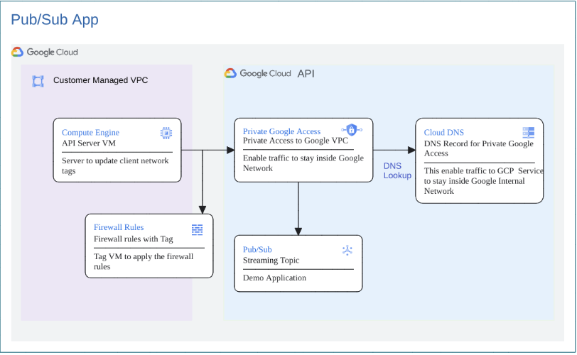
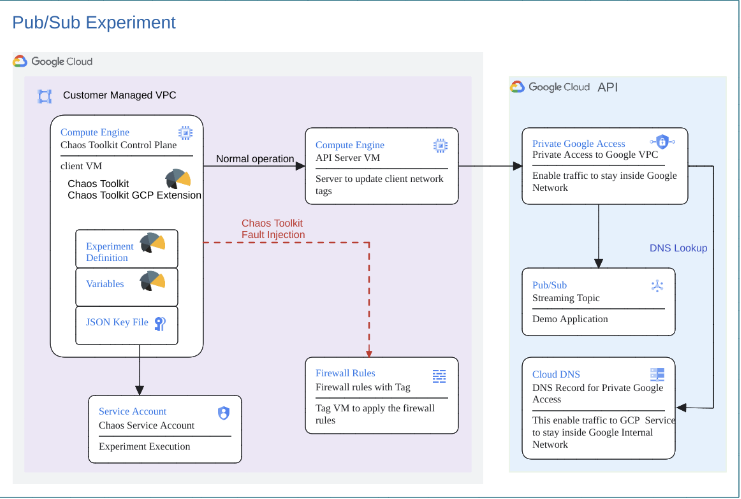

# Overview

This documentation illustrates the steps involved in executing an end to end proof of concept to demonstrate the ability to introduce faults in resources from a VPC like compute instances can access the gcp services like Pub/Sub through private google access , primarily leveraging the Chaos Toolkit framework and its GCP extension. It has two components, application, and chaos experiment.

## Jumpstart Guide

Here is the directory structure

```
$ROOT_FOLDER_OF_THE_REPO
└── chaostoolkit-examples
    └── l7ilb-urlmap-fault-injection
        └── scripts
            ├── 1-init.sh
            ├── 2-provision.sh
            ├── 3-1-check_client_log.sh 
            ├── 3-2-check_server_log.sh 
            ├── 3-3-copy_to_client.sh 
            ├── 3-4-ssh_to_client.sh
            ├── 3-5-remote_run.sh
            └── 9-cleanup.sh
```

This recipe can be run by following these steps, `cd chaostoolkit-examples/pubsub-fault-injection/scripts`

1. Initiate the environment, `./init.sh`

2. Provision the application and chaos experiement,`./provision.sh`

3. Experiment Execution, `./ssh_to_client.sh` to ssh to the client VM, then run `./run.sh`, or you can just run `./remote_run.sh`

4. Cleanup, `./cleanup.sh`

That's it. Let us dive in.

## The Steady State Application

The following diagram illustrates an applicaiton subscribing to pub/sub topics. 



#### Picture 1: Application Architecture


## app Subdirectory

This is to create the target application used for chaos experiment.

### scripts Subdirectory

This folder has vm starup scripts and the basic python code for publishing the messages from a text file to pubsub using python sdk client to a topic. 

| File                       | Description |
| ------                     | ----------- |
|`client_startup.sh`         | Startup script to run when provisioning client VM|
|`run.sh`                    | Shell script run the experiment by executing `chaos run experiment.json --var-file=variables.env`|
|`setupApp.sh`               | Shell script to setup the service account and variavble files for running terraform provisioning|


### Terraform Subdirectory
On execution of this terraform module, the following infrastructure components will be deployed on a given project ID:

| File                      | Description |
| ------                    | ----------- |
|`api.tf`                   | To enable mandatory APIs required for deploying the infrastructure components|
|`dns.tf`                   | For deploying DNS record for private google apis |
|`gce-server.tf`            | For deploying the server instances on GCP|
|`outputs.tf`               | File used to define output declarations in Terraform configuration files.|
|`provider.tf`              | File that allows Terraform to interact with Google Cloud.|
|`pubsub`                   | Pub/Sub topic|
|`sa.tf`                    | For creating the service account to be used for running the application|
|`server-startup.tf`        | Used to generate server startup script on the VM to run when provioning server VM|
|`terraform.tfvars.template`| Defines the actual value of variables for Terraform infrastructure deployment. Use this file to plug in custom values for any Terraform variable(s). `../setup.sh` use it to generate `terraform.tfvars`.|
|`variables.tf`             | For the declaration of variables, name, type, descriptiI hope yoon, default values and additional meta data.|
|`vpc.tf`                   | Creating VPC|


# Choas Experiment:  

This experiment demonstrates how faults can introduced in the compute instance network tag and firewall not allowing the traffic from private google access IPs. The steady state is application responding 200 from server and when network tag is changed applying firewall, it responds with a 500. The following is the architecture diagram for the chaos experiment.



#### Picture 2: Chaos Experiment Architecture


This directory has three subdirectories as follows:-

### config Subdirectory

| File                       | Description |
| ------                     | ----------- |
|`experiment.json  `         | Defintion file for the chaos experiment|

### scripts Subdirectory
This folder has vm starup scripts and the basic python code for publishing the messages from a text file to pubsub using python sdk client to a topic. 

| File                       | Description |
| ------                     | ----------- |
|`client_startup.sh`         | Startup script to run when provisioning client VM|
|`run.sh`                    | Shell script run the experiment by executing `chaos run experiment.json --var-file=variables.env`|
|`setupChaos.sh`                  | Shell script to setup the service account and variavble files for running terraform provisioning|


### Terraform Subdirectory
On execution of this terraform module, the following infrastructure components will be deployed on a given project ID:

| File                      | Description |
| ------                    | ----------- |
|`api.tf`                   | To enable mandatory APIs required for deploying the infrastructure components|
|`check_client_log.tf`      | The template file that generates `check_client_log.sh` file|
|`experiment-variables.tf`  | The template file that generates the `variables.env` file|
|`firewall.tf`              |  Firewall|
|`gce-client`               | For deploying the client and server instances on GCP|
|`gsutil.tf`                | Copy libarary  code to GCS bucket and then copy to VM to  override open sourcece code|
|`outputs.tf`               | File used to define output declarations in Terraform configuration files.|
|`provider.template`        | File that allows Terraform to interact with Google Cloud.|
|`remote_run.tf`            | The template file that generates the `remote_run.sh` file|
|`sa.tf`                    | For creating the chaos service account to be used for running `experiment.json`|
|`scp_to_client.tf`         | The template file that generates the `copy_to_client.sh` file|
|`ssh_to_client.tf`         | The template file that generates the `ssh_to_client.sh` file|
|`terraform.tfvars.template`| Defines the actual value of variables for Terraform infrastructure deployment. Use this file to plug in custom values for any Terraform variable(s). `../setup.sh` use it to generate `terraform.tfvars`.|
|`variables.tf`             | For the declaration of variables, name, type, descriptiI hope yoon, default values and additional meta data.|

## PreRequisites
1. Make sure that you have Google CLI and Terraform installed.
2. The GCP user to run the experiment should have the permissions to impersonate the terraform service account used to create the resources.
```
    Service Account Token Creator
    Service Account User
    Servie Uasge Admin
```

3. The following IAM permissions are required on the terraform service account to create the GCP infra resources required for this experiment, run [createSA.sh](scripts/createSA.sh) once to create them. If new roles are identifed for the SA, please modify the scripts and run it again.
    
```
    Compute Admin 
    Compute Network Admin
    PubSub Admin
    DNS Administrator
    Monitoring Editor 
    Service Usage Consumer
    Create Service Account
    Delete Service Account
```
4. If it doesn't exist, please create a GCS Bucket for Terraform Backend for the project, the name need to be `${project-Id}-terraform-backend`. For example, if the project id you work on is `chaos-test-project-410715`, then the bucket name should be `chaos-test-project-410715-terraform-backend` Please also create local folder for terraform to generate some helper scripts.
```
sudo mkdir -p /opt/chaostoolkit-examples/
sudo chmod -R 777 /opt/chaostoolkit-examples
```

## Experiment Execution
1. Login to GCP project using `gcloud auth login` on the terminal to execute terraform resources and set the project.
2. Clone the repository to your system and cd into `chaostoolkit-examples/pubsub-cloudrun-fault-injection/app/scripts` directory.
3. For deploying new infrastructure only, you may optionally update the `terraform.tfvars` file with the appropriate values. For information regarding the resources created by terraform and the variables required, pls check [Terraform README.md](terraform/README.md)
4. In case pre-existing testing infrastructure exists, skip to step 6.
5. Run [setupApp.sh](app/scripts/setupApp.sh) to create this service account. Then cd into `terraform` folder and run `terraform init` to initialize Terraform, `terraform validate` to validate the configuration, `terraform plan` to visualize the components that will be created, and `terraform apply` to deploy the infrastructure on the set project. Your testing infrastructure should now be ready. Please make a note of the project_id, server_IP and client_IP created for running the experiment from terraform output. Terraform will create a [service account key](https://cloud.google.com/iam/docs/keys-create-delete?_ga=2.31241532.-2014251715.1702981216) for the service account created by terraform. This will be used for running the experiment. Incase the Infra is pre-existing, please use a service account with the following IAM roles:
```
    roles/compute.instanceAdmin.v1 
    roles/pubsub.admin
    roles/pubsub.publisher 
    roles/dns.admin
```
    
The following are all the commands in the item 5.
    
```
    (~) $ cd app/scripts
    (scripts) $ ./setupApp.sh
    (scripts) $ cd ../terraform
    (terraform) $ terraform init
    (terraform) $ terraform plan
    (terraform) $ terraform apply
```

The applicaiton will be created after `terraform apply`.  The following files under `/tmp/pubsub-fault-injection` will be generated by `terraform/template.tf`.


On the server VM, it will bootstrap a Python Flask Server:
----------------------------

Server startup scripti template[server-startup.tf](app/terraform/server-startup.tf) will be used to created a startup script for the server and install the packages needed for running python file and create 2 files on the server VM.

| File                | Description|
| ----                | -----------|
|`flask_server.py`    |This python file has the code for publishing messages from a file to pubsub using python sdk client to a topic "hellopsc", the topic is being created as a part of terraform |
|`messages_server.txt`|This text file has the message that needs to be published to the pubsub|

As the last step in the startup script, it will run `python3 flask_server.py <gcp_project_id>` where `<gcp_project_id>` will be substitued with the current GCP Project Id. Please check the logs before proceeding to the next step. 

```
    (scripts) $ ./check_server_log.sh 
    WARNING: 

    To increase the performance of the tunnel, consider installing NumPy. For instructions,
    please see https://cloud.google.com/iap/docs/using-tcp-forwarding#increasing_the_tcp_upload_bandwidth
	
    Warning: Permanently added 'compute.6419179147882177425' (ECDSA) to the list of known hosts.
    Jan 24 16:03:26 debian systemd[9110]: Listening on GnuPG cryptographic agent and passphrase cache (access for web browsers).
    Jan 24 16:03:26 debian systemd[9110]: Listening on GnuPG cryptographic agent and passphrase cache (restricted).
    Jan 24 16:03:26 debian systemd[9110]: Listening on GnuPG cryptographic agent (ssh-agent emulation).
    Jan 24 16:03:26 debian systemd[9110]: Listening on GnuPG cryptographic agent and passphrase cache.
    Jan 24 16:03:26 debian systemd[9110]: Reached target Sockets.
    Jan 24 16:03:26 debian systemd[9110]: Reached target Basic System.
    Jan 24 16:03:26 debian systemd[1]: Started User Manager for UID 1000.
    Jan 24 16:03:26 debian systemd[1]: Started Session 4 of user yujunl.
    Jan 24 16:03:26 debian systemd[9110]: Reached target Main User Target.
    Jan 24 16:03:26 debian systemd[9110]: Startup finished in 58ms.
```

This indicates that the server started successfully. 

6. Run [chaos-experiment/script/setupChaos.sh](chaos-experiment/scripts/setupChaos.sh) to create the resources for chaos experiment.
  
```
    (~) $ cd ../../chaos-experiment/scripts
    (scripts) $ ./setupChaos.sh
    (scripts) $ cd ../terraform
    (terraform) $ terraform init
    (terraform) $ terraform plan
    (terraform) $ terraform apply
```
    
The following files will be generated under `$folder` folder defined in `.setEnv.sh`

 File                  | Description |
 ------                | ----------- |
|`check_client_log.sh` | Shell script to ssh to the client vm and do `tail -f /var/log/syslog` on that VM|
|`check_server_log.sh` | Shell script to ssh to the server vm and do `tail -f /var/log/syslog` on that VM|
|`copy_to_client.sh`   | Generated shell script to SCP all the file under `../chaos-experiment-config` to client VM|
|`remote_run.sh`       | Generated shell script to SSH to client VM and run the experiment|
|`ssh_to_client.sh`    | Generated shell script to SSH to client VM|


Scripts under this  directory can be used to call those generated scripts

```
$ROOT_FOLDER_OF_THE_REPO
└── chaostoolkit-examples
    └── l7ilb-urlmap-fault-injection
        └── scripts
            ├── 1-init.sh
            ├── 2-provision.sh
            ├── 3-1-check_client_log.sh 
            ├── 3-2-check_server_log.sh 
            ├── 3-3-copy_to_client.sh 
            ├── 3-4-ssh_to_client.sh
            ├── 3-5-remote_run.sh
            └── 9-cleanup.sh
```

You can proceed to run `(scripts) $ ./3-1-check_client_log.sh` 

```
    Jan 31 17:25:58 debian google_metadata_script_runner[857]: startup-script: Using /var/.venvs/chaostk/lib/python3.9/site-packages
    Jan 31 17:25:58 debian google_metadata_script_runner[857]: startup-script: Finished processing dependencies for chaostoolkit-google-cloud-platform==0.14.1
    Jan 31 17:25:58 debian google_metadata_script_runner[857]: startup-script exit status 0
    Jan 31 17:25:58 debian google_metadata_script_runner[857]: Finished running startup scripts.
    Jan 31 17:25:58 debian systemd[1]: google-startup-scripts.service: Succeeded.
    Jan 31 17:25:58 debian systemd[1]: Finished Google Compute Engine Startup Scripts.
    Jan 31 17:25:58 debian systemd[1]: google-startup-scripts.service: Consumed 4min 6.976s CPU time.
    Jan 31 17:25:58 debian systemd[1]: Reached target Multi-User System.
    Jan 31 17:25:59 debian systemd[1]: Reached target Graphical Interface.
    Jan 31 17:25:59 debian systemd[1]: Starting Update UTMP about System Runlevel Changes...
    Jan 31 17:26:00 debian systemd[1]: systemd-update-utmp-runlevel.service: Succeeded.
    Jan 31 17:26:00 debian systemd[1]: Finished Update UTMP about System Runlevel Changes.
    Jan 31 17:26:00 debian systemd[1]: Startup finished in 2.268s (kernel) + 4min 5.480s (userspace) = 4min 7.749s.
    Jan 31 17:26:05 debian dhclient[459]: XMT: Solicit on ens4, interval 125840ms.
```

This indicates that the client completed installing chaos toolket and dependencies. You can proceed to the next steps:

6. You can run `./3-5-remote_run.sh` to run experiment. Alternatively, you can use `./3-4-ssh_to_client.sh` to SSH to client machine. When you are in the shell of client machine, you can run the folowing experiment,

```
    (~) $ ./run.sh   #for experiment
```

This command will execute `chaos run experiment.json --var-file=variables.env`. Expect the following output:

```
    [2024-02-05 16:59:15 INFO] Validating the experiment's syntax
    [2024-02-05 16:59:17 INFO] Experiment looks valid
    [2024-02-05 16:59:17 INFO] Running experiment: What is the impact of introducing fault in Pubsub using private google access
    [2024-02-05 16:59:17 INFO] Steady-state strategy: default
    [2024-02-05 16:59:17 INFO] Rollbacks strategy: default
    [2024-02-05 16:59:17 INFO] Steady state hypothesis: Application responds
    [2024-02-05 16:59:17 INFO] Probe: python process running and returning 
    [2024-02-05 16:59:17 INFO] Steady state hypothesis is met!
    [2024-02-05 16:59:17 INFO] Playing your experiment's method now...
    [2024-02-05 16:59:17 INFO] Action: set network tag for instance
    [2024-02-05 16:59:21 INFO] Pausing after activity for 5s...
    [2024-02-05 16:59:26 INFO] Steady state hypothesis: Application responds
    [2024-02-05 16:59:26 INFO] Probe: python process running and returning 
    [2024-02-05 16:59:50 CRITICAL] Steady state probe 'python process running and returning ' is not in the given tolerance so failing this experiment
    [2024-02-05 16:59:50 INFO] Let's rollback...
    [2024-02-05 16:59:50 INFO] Rollback: set network tag for instance
    [2024-02-05 16:59:50 INFO] Action: set network tag for instance
    [2024-02-05 16:59:54 INFO] Pausing after activity for 5s...
    [2024-02-05 16:59:59 INFO] Experiment ended with status: deviated
    [2024-02-05 16:59:59 INFO] The steady-state has deviated, a weakness may have been discovered
```

If you see the following error, please run `./3-1-check_client_log.sh` to make sure the VM bootstrap script is complete. 
```
./run.sh: line 1: /var/.venvs/chaostk/bin/activate: No such file or directory
./run.sh: line 2: chaos: command not found
```

## CleanUp
1. Cleanup of the experiment is included in the `experiments.json` file and runs automatically once the experiment is complete.
2. In case any infrastructure was deployed for the testing only, run `terraform destroy` to delete the test infrastructure. Make sure that the only state file in the directory is of the test infrastructure, otherwise any other Terraform infrastructure could also be deleted accidentally.

You can run this script, `./cleanup.sh`
