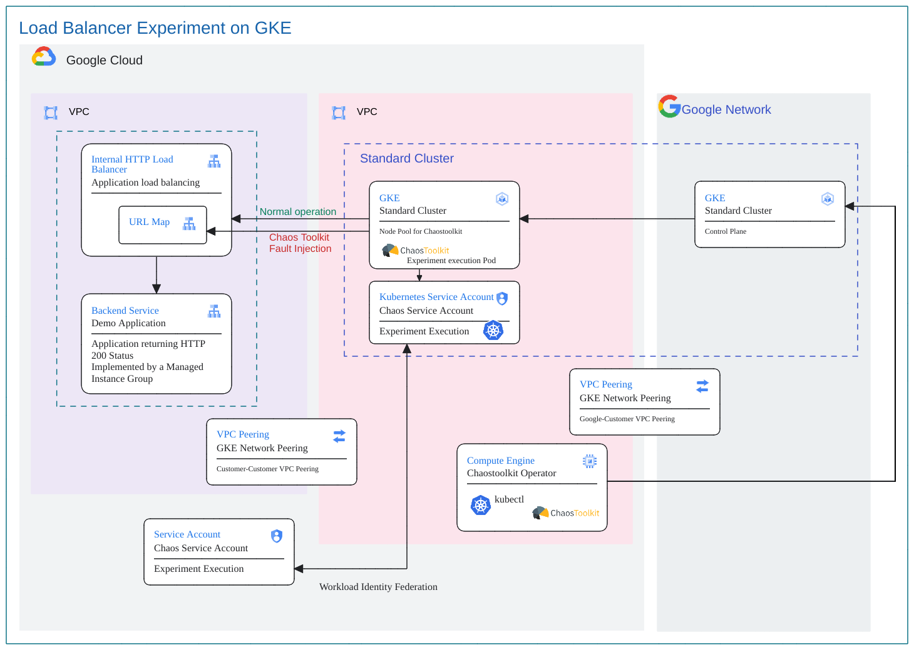

# Overview
This documentation illustrates the steps involved in creating GKE environment for using Chaostoolkit GKE Operator to deploy chaos experiments to run as a Kubernetes Pod.

## Jumpstart Guide

This recipe can be run by following these steps.

1. Initilize the environment,

```
cd gke-chaostoolkit-operator/scripts
./1-init.sh
```

2. Provision the GKE clusters

Use the following comment to provision the GKE clusters, 

```
./2-provision.sh
```

3. Run chaos experiment

Please refer to [l7ilb-urlmap-fault-injection-gke](../chaostoolkit-examples/l7ilb-urlmap-fault-injection-gke) for an example of using GKE Operator for Chaostoolkit to run a chaos experiment. In that example, it creates an application and then use the GKE Operator for Chaostoolkit to deploy an experiment to the GKE cluster to run as a pod.
 
4. Clean up

After completing the experiment, you can use the following command to clean up the GKE cluster.

```
./9-cleanup.sh
```

That's it. Let us dive in.

## GKE Environment

The following diagram illustrates an environment with two GKE Clusters, one Autopilot, and one standard. And how it connects to an application for chaos experiment. The VPC for the applicaiton needs to have a VPC Peering with the network for GKE Cluster.


#### Picture 1: Kuberentes Chaostoolkit Operator Architecture

## [Deploy Chaos Toolkit as a Kubernetes Operator](https://chaostoolkit.org/deployment/k8s/operator/)

1. Download [kustomize](https://github.com/kubernetes-sigs/kustomize) into `/opt/chaostoolkit` folder.
```
cd /opt/chaostoolkit
curl -s "https://raw.githubusercontent.com/kubernetes-sigs/kustomize/master/hack/install_kustomize.sh" | bash
```
2. Clone [Chaostoolkit Operator](https://github.com/chaostoolkit-incubator/kubernetes-crd)
```
git clone https://github.com/chaostoolkit-incubator/kubernetes-crd.git
```
3. Customize any configuarion by using [Kustomize](https://kustomize.io/)

For example, the resource quota is cusomized by [kustomization.yaml](kustomization/kustomization.yaml) and [configmap.yaml](kustomization/configmap.yaml) overlay.

This is the resources quota the `configmap.yaml` file, 
```
resources:
  limits:
    cpu: 500m
    memory: 384Mi
  requests:
    cpu: 500m
    memory: 384Mi
```

And this is the [patches](https://kubectl.docs.kubernetes.io/references/kustomize/kustomization/patches/) section in the overlay file to replace the pod definition in the base resourcesusing `configmap.yaml` in this folder.


```
patches:  
- path: configmap.yaml
  target:
    kind: ConfigMap
```


These two files will be copied to `/opt/gke-chaostoolkit-operator/overlay` folder on the Chaostoolkit GKE Operator VM, and the following command will create the operator with the customized configuations, for example, resources quota,

```
./kustomize build overlay | kubectl apply -f -
```

The above steps will be performed by [client_startup.sh](terraform/client_startup.tf) and `switch_to_autopilot.sh` or `switch_to_standard.sh` at the VM startup time.

When you deploy an experiment, the resources section of the pod will be like this, 

```
"resources": {
    "limits": {
        "cpu": "500m",
        "memory": "384Mi"
    },
    "requests": {
        "cpu": "500m",
        "memory": "384Mi"
    }
},
```


## Directory structure

This directory has three subdirectories as follows:-

```
gke-chaostoolkit-operator/
└── diagrams
    ├── loadbalancer-exp-gke.excalidraw
    └── loadbalancer-exp-gke.png
└── kustomization
    ├── configmap.yaml
    └── kustomization.yaml
└── scripts
    ├── 1-init.sh
    ├── 2-provision.sh  
    ├── 3-1-deploy-to-standard.sh  
    ├── 3-2-deploy-to-autopilot.sh  
    ├── 9-cleanup.sh
    ├── .setEnv.sh
    ├── .createSA.sh
    └── .setupApp.sh
└── terraform
    ├── api.tf
    ├── autopilot.tf
    ├── client_startup.tf
    ├── deploy-chaostoolkit-operator.tf
    ├── firewall.tf
    ├── gce-client.tf
    ├── gke.tf
    ├── kubectl_describe_pod.tf
    ├── kubectl_get_pod.tf
    ├── kubectl_logs.tf    
    ├── network.tf    
    ├── outputs.tf
    ├── privider.template
    ├── README.md
    ├── sa.tf
    ├── scp_to_client.tf    
    ├── terraform.tf.template
    └── variables.tf 
```

### scripts Subdirectory
This folder is for shell scripts

| File                       | Description |
| ----                       | ----------- |
|`1-init.sh`                 | Shell script to initialize the envionment to run terraform.|
|`2-provision.sh`            | Shell script to provision the GKE clusters|
|`3-1-deploy-to-standard.sh` | Shell script deploy the Chaostoolkit Operator to Standard GKE clusters|
|`3-2-deploy-to-autopilot.sh`| Shell script deploy the Chaostoolkit Operator to Standard GKE clusters|
|`9-cleanup.sh`              | Shell script to execute `terraform destroy` to clean up the GKE clusters |
|`.setEnv.sh`                | Shell script to create environment variables |
|`.createSA.sh`              | Shell script to create Service Account |
|`.setupApp.sh`              | Shell script to setup the envionment to run terraform.|

### Terraform Subdirectory

On execution of this terraform module, the following infrastructure components will be deployed on a given project ID:- 

| File                            | Description |
| ----                            | ----------- |
|`api.tf`                         | To enable mandatory APIs required for deploying the infrastructure components|
|`autopilot.tf`                   | Creating an Autopilot GKE Cluster|
|`client_startup.tf`              | The file for deploying infrastructure components such as Cloud SQL instance with Private Service Connect|
|`deploy-chaostoolkit-operator.tf`| The file for deploying infrastructure components such as Cloud SQL instance with Private Service Connect|
|`firewall.tf`                    | The file for deploying infrastructure components such as filewall rules.|
|`gce-client`                     | For deploying the toxiproxy server instances on GCP|
|`gke.tf`                         | The file for deploying standard GKE cluster|
|`kubectl_describe_pod.tf`        | Describe the pod running the experiment|
|`kubectl_get_pod.tf`             | Generate JSON output for the get pod running the experiment|
|`kubectl_logs.tf`                | Display the logs from the pod running the experiment|
|`network.tf`                     | The file for deploying infrastructure components such as network.|
|`outputs.tf`                     | File used to define output declarations in Terraform configuration files|
|`provider.template`              | File that allows Terraform to interact with Google Cloud|
|`sa.tf`                          | For creating the service account to be used for running application|
|`scp_to_client.tf`               | SCP some linux scripts to client VM|.
|`terraform.tfvars.template`      | Defines the actual value of variables for Terraform infrastructure deployment. Use this file to generate custom values for any Terraform variable(s) in `terraform.tfvars` file|
|`variables.tf`                   | For the declaration of variables, name, type, description, default values and additional meta data|

## Provision GKE Cluters

To provision, run the folllowing commands from the `scripts` folder
```
./1-init.sh
./2-provision.sh
```

After provision is done, the following two scripts will be egenerated by  [deploy-chaostoolkit-operator.tf](terraform/deploy-chaostoolkit-operator.tf) and executed on the Kubernetes Operator VM,
`./switch-to-autopilot.sh` to swith to GKE Autopilot Cluster to run the experiment; and `./deploy-to-standard.sh` for Standard Cluter.

| File                    | Description |
| ----                    | ----------- |
|`copy_to_client.sh`      | Shell script to SCP all the file under `experiment.yaml` to client VM|
|`switch_to_autopilot.sh` | Switch the Linux session to use the autopilot cluster|
|`switch_to_standard.sh`  | Switch the Linux session to use the standard cluster|
|`kubectl_descr.sh`       | Describe the pod running the experiment|
|`kubectl_get.tf`         | Generate JSON output for the get pod running the experiment|
|`kubectl_logs.tf`        | Display the logs from the pod running the experiment|

Config [Workload Identity Federation for GKE](https://cloud.google.com/kubernetes-engine/docs/how-to/workload-identity)

Please refer to [l7ilb-urlmap-fault-injection-gke](../chaostoolkit-examples/l7ilb-urlmap-fault-injection-gke) for an example of using GKE Operator for Chaostoolkit.

1. Switch Clusters between autopilit and standard, `switch_to_autopilot.sh` and `switch_to_standard.sh`.
2. Deploy chaos experiment using Operator, `gke_delpoy.sh`. A pod will be created to run the experiment.
3. Use `kubectl_logs.sh` to check the log of the experiment.
4. If there is a problem, you can use `kubectl_get.sh` or `kubectl_describe.sh` to view the pod information and debug.

### Output

The following output variables are used by the experiment project to generate GKE deployment manifest.

| Output                | Usage|
|-----------------------|------|
| project_id            | Indicate the project where the GKE clubters are deployed|
| region                | The region the GKE cluster deployed to|
| vm_name               | the name of the GCE VM used  to run kubectl command|
| gke_network_self_link | The self link of the network used for VPC PEering|

### clean up

```
./9-cleanup.sh
```
